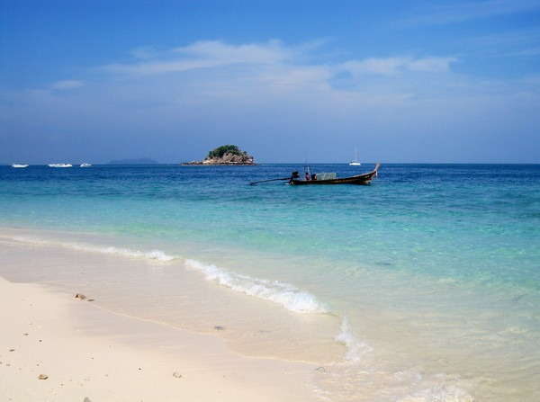
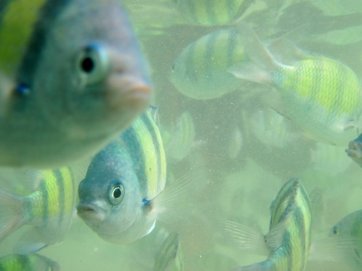

My posts are getting a little out of sequence. Although I have more to say about Chiang Mai, I want to get out my photos from the Phi Phi Islands. The Phi Phi Islands are off the coast of Phuket. We got to snorkel at two different places. The water was a little murky, but still had good visibility. Someone mentioned that it gets much clearer the further away from the rainy season. All underwater shots are by Nick (aka TheTailGunner). I also got a chance to hike up to the top viewpoint of Ko Phi Phi Don. Once up there I had to race back down so I wouldn't miss the boat. I made it just in time.    [Photo Gallery for the Phi Phi Islands, Thailand](https://www.flickr.com/photos/129592470@N02/sets/72157647822502563/)