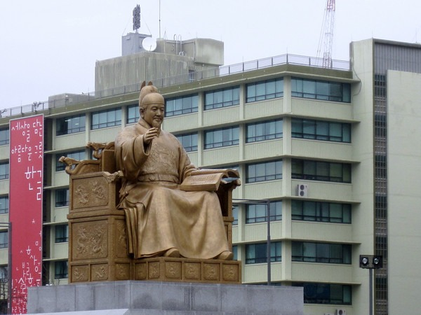
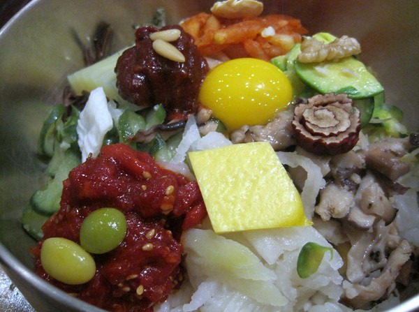

On the return flight home to Seattle, I had a 12 hour layover in Seoul, South Korea. Urban hiking in 41F rain felt a lot like Seattle. Like [Kuala Lumpur](/2009/12/arrived-in-kuala-lumpur-malaysia/), Seoul has an airport which connects right into a train/subway system. I was able to get to the heart of downtown Seoul in about an hour. For a city of 10 million people, I expected the streets to be packed, but they weren't. Where was everyone?

My short trip did give me enough time to eat some great food and acquire some outstanding Korean green tea. Now for the photos.

---

## Comments

### TigerAl
*December 12 at 2009 at 2:41 AM*

So, which was your favorite city on this trip, maybe one you will visit again and why (even though I know you don't really like to do the repeat visits)?

---

### MAS
*December 12 at 2009 at 6:24 PM*

Probably Chiang Mai, Thailand.  It had the best food, best air quality and elephants!

---

