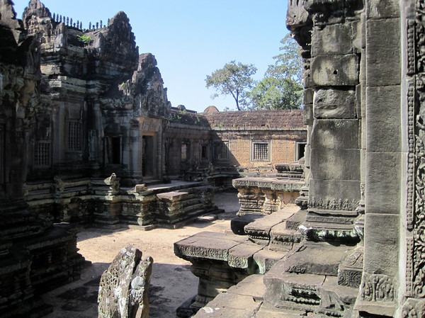
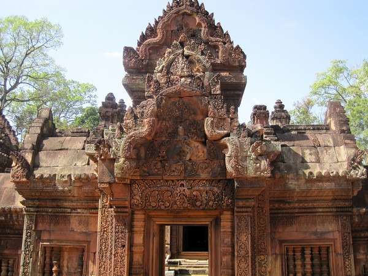
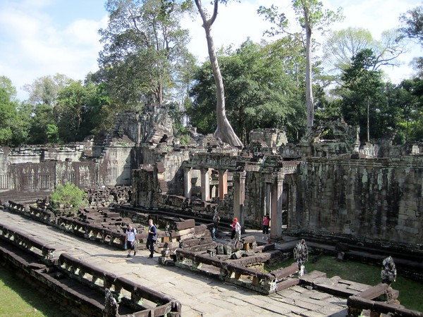

[Angkor Wat](https://en.wikipedia.org/wiki/Angkor_Wat) is the expansive temple complex in Cambodia built over a few hundred years starting in the 10th century. It is an amazing place to visit. It far exceeded myexpectations. I spent 2 days and one evening going from temple to temple and I still didn't see it all. Besides the food and my elephant training, this was the highlight of my month trip in Asia. The photo gallery I created is quite extensive at 467 photos.The morning sun was harsh, but I was able to fix many of the photos on my PC. The last few pages of the gallery are photos taken in the late afternoon. They turned out the best. If you find yourself in Southeast Asia, you must visit.  Here I am outside the temple door that was in the movie Laura Croft Tomb Raider.      [Photo Gallery for Angkor Wat - Siem Reap, Cambodia](https://www.flickr.com/photos/129592470@N02/sets/72157647793375104/)