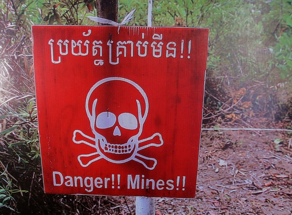
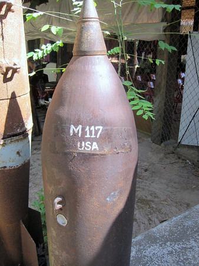

The sad history of Cambodia involves land mines. Lots of them. I read an estimate that there may still be 2 million land mines buried in throughout the country. And no one bothered to document where they were placed. As a result, people are still being killed andmaimedtoday. While in Cambodia, I saw quite a few adults and kids with missing limbs.

In between Angkor Wat temple visits, we stopped into the [Cambodian Landmine Museum](https://www.cambodialandminemuseum.org/).

