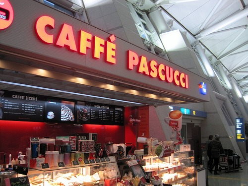
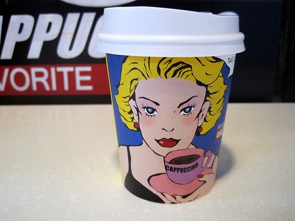
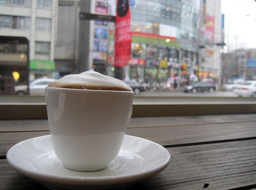

Yesterday I had a 12-hour layover in Seoul, South Korea. Instead of hanging out at the airport, I decided to venture into the city and seek out some coffee. Before heading out, I got a good espresso from Caffe Pascucci. That provided enough fuel for me to leave the airport and make my way downtown.  Seoul is loaded with coffee shops. Everywhere I turned there was a sign for some cafe. Because I didn't have any leads on where the quality places were, I had to throw the dice down and gamble on which place might be good. I didn't do so well. The places I picked outside the airport were lousy to mediocre. Oh well, I did get some cool photos!   