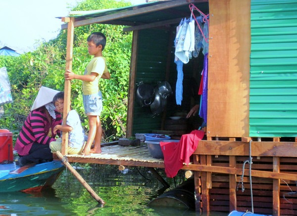

While in Siem Reap, we had our driver take us out to the Floating Village. Unlike our [Bangkok experience](/2009/11/missing-circuit-city-at-the-floating-market/), this was not a tourist trap. It was the real deal. The Floating Village was a community of mostly fishermen living on the water. Many fled Vietnam during the war and were never allowed to return home.

The floating village is a working community. These people live, work and raise their kids on the water. Young kids know how to fish and navigate boats. Neighbors hang out with each other. They don't have any of the creature comforts of the modern world, but they seemed content. This trip redefined extreme working poverty for me.

One of the themes I'll go back to a different post is how Americans live in a culture of fear. We have every advantage, but spend our days fearing that will lose our _stuff_ or health or job. These people have nothing but each other and they seemed fine. Despite the brutally low standard of living, it was inspiring.

[Photo Gallery for Floating Village - Siem Reap, Cambodia](https://www.flickr.com/photos/129592470@N02/sets/72157650132863352/)

Although I am very pleased with my photos, my camera battery was near dead during this portion of my trip, so I didn't get near the number of pictures I would have liked to.

---

## Comments

### Ed
*December 20 at 2009 at 6:29 AM*

I suppose in the looming post global collapse, these types of people will survive much easier then the average American. Real survival skills such as fishing and farming combined with their friendliness type culture, ought to have an enduring impact.

I wonder if those vegetables are organic in that canoe?

---

### MAS
*December 20 at 2009 at 4:51 PM*

Not sure about their farming technique.  I do know the eggs and meat were outstanding quality.

---

### Joan
*March 4 at 2011 at 9:28 AM*

I visited there in January 2011 and was terribly upset how small children were exploited, hanging off our boat with pythons around their necks and crying hysterically in our faces for a dollar.

---

