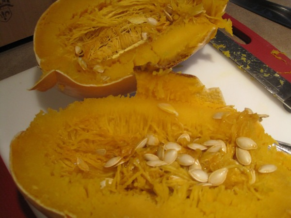
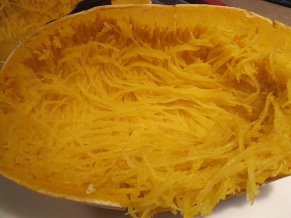
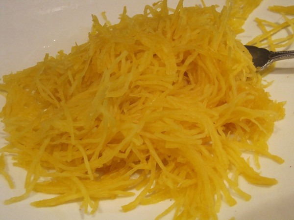

I just made spaghetti squash for the first time. It was super easy and delicious. There are numerous tutorials online that take this simple dish and convert it to multi-page tutorials littered with advertising. Not necessary. Here is my 1 page, 0 ad tutorial on making spaghetti squash.

1.  Pre-heat oven to 390F.
2.  Poke holes in the squash.
3.  Bake for 1 hour.
4.  Let it cool.
5.  Cut lengthwise.
6.  Scoop out the seeds.
7.  Using a fork, gently pull out the spaghetti.
8.  Add your sauce and meatballs.
9.  Eat.

   

---

## Comments

### Jeremy
*December 25 at 2009 at 9:30 PM*

That looks um. . . Tasty.

---

