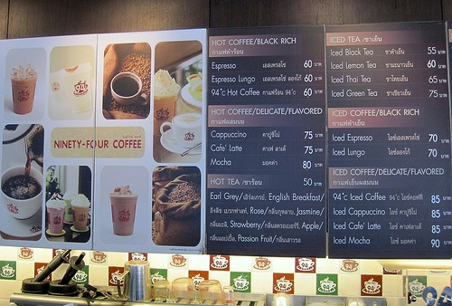

During one of my urban hikes through the streets of Bangkok, I discovered _Ninety Four Coffee_. It was a Western-style coffee house serving a full complement of espresso-based drinks and pastries. Comfortable chairs and big windows. The name _Ninety Four_ comes from 94 degrees Celsius, which they state is the brewing temperature of coffee.

**94 degrees Celsius = 201.2 degrees Fahrenheit**

 _94 Coffee_

No matter where I travel in this world, I always seem to attract 1970s American pop music. Thailand was no different and 94 Coffee delivered. While in the cafe, I heard Christopher Cross, Nicolette Larson, and Dan Fogelberg. Despite what the travel books tell you, few people in Thailand speak English. So hearing the cheesy 70s pop at _94 Coffee_ should have been ironic, but it is something I've come to expect.

When I ordered an espresso, the barista looked frightened and ran off to grab another employee. The other employee knew the word "espresso" in English and was able to assist with taking my order. Like the vast majority of places I visited in Thailand, the espresso was over roasted, slightly over-extracted and bitter. _Ninety Four Coffee_ was better than most though.

 _Espresso at 94 Coffee_

They offer free WIFI, but they didn't provide me the password. I considered asking for the password, but if the barista didn't understand the word "espresso", getting a WIFI password was going to be even more challenging. So I walked up to the counter and looked around. There were some numbers written on a paper taped to the register. That was the password.

Total cost for the espresso was 60 baht, which is $1.80 US. Thailand is cheap when it comes to food and lodging, but coffee prices tend to be similar to those in the United States.

 _94 Coffee Menu_