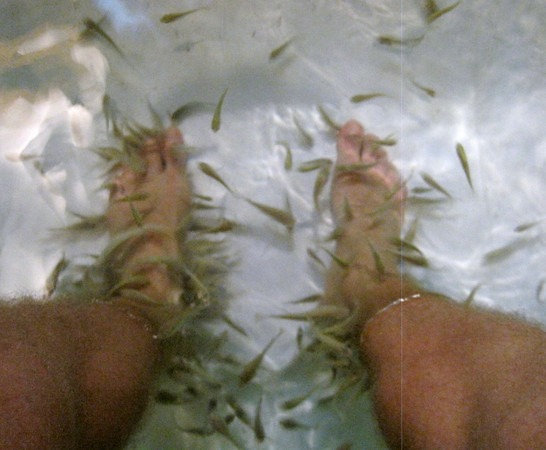
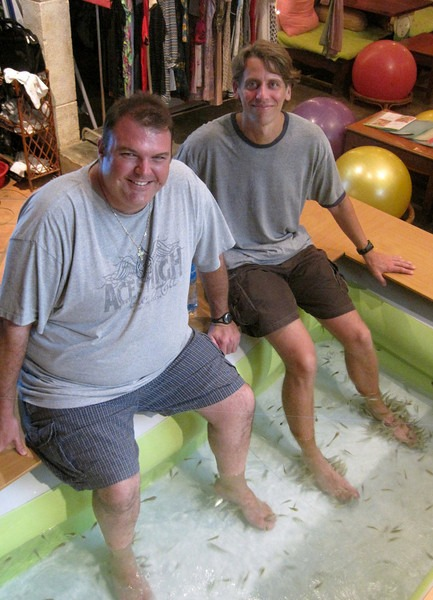

This was too weird and cheap not to try. Siem Reap, Cambodia has something called Angkor Dr. Fish Massage. Basically you put your feet into a tank of water filled with little fish. The fish then swarm your feet and eat off the dead skin. I think that is what they said. It is an odd feeling.

20 Minute Fish Massage - $3. This story - priceless. :)

_Left =_ _TheTailGunner__, Right = MAS, Below = Lots of Fish!_

---

## Comments

### DHammy
*December 16 at 2009 at 1:08 PM*

That's awesome!  I've seen this before and thought it would be cool to try.  But it would seem like an act of animal cruelty to subject those fish to my feet...

---

### TigerAl
*December 16 at 2009 at 4:46 PM*

Ok, another one of the "no way in h- - - will I ever try this" experiences for me...

BTW, why do you have considerably more fish around your feet that the TailGunner and is that a good or bad thing? :)

---

### MAS
*December 16 at 2009 at 5:56 PM*

@TigerAl - You are correct about the fish.  They did like me better.  Maybe because I was sitting more in the corner and away from the street?  I could have changed seats to see if that made a difference.  That is a mystery that will remain unsolved.  ;)

---

### TigerAl
*December 16 at 2009 at 6:49 PM*

... another theory could be that your feet needed more "doctoring"! :)

---

### MAS
*December 16 at 2009 at 6:53 PM*

You know I do wash my socks in a mixture of TIDE and peanut butter.  Maybe that is the reason?  :)

---

