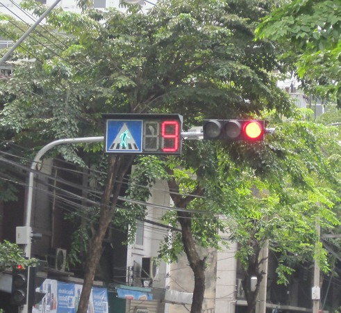
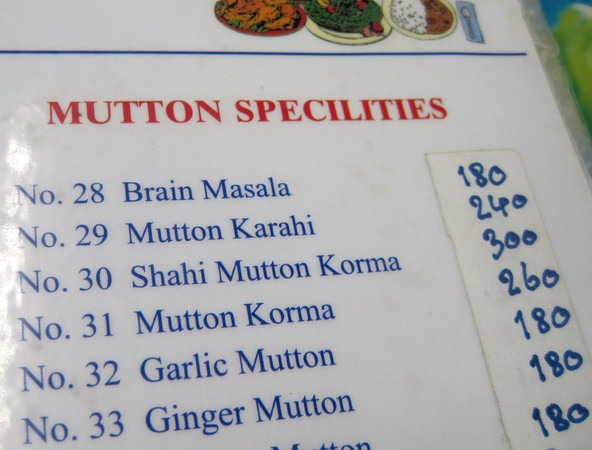

As much as a bad user interface annoys me, I really enjoy discovering an excellent U/I. While in Thailand and Cambodia, I noticed a brilliant user interface. They place a second counter on traffic lights. When a light turns green or red, there is a second counter to the side of it. You know exactly when the light will change.  _11 Seconds left on this green light in Siem Reap, Cambodia_ Here in the States, people use red lights to apply makeup, drink coffee and light their smokes. Having a second counter on the light would give our multi-tasking drivers a visible indicator on how much time they have before the guy behind them blasts his horn. I love it.  _9 seconds left on this red light in Bangkok, Thailand_ TheTailGunner mentioned a potential downside. He saw drivers gunning their cars a second or two ahead of time. So a red light with 1 or 2 seconds left is equal to a green light. At first I conceded this point, but when I went back to the intersection to witness the traffic dance, I noticed that in heavy traffic it is more likely that the side with the green light will run the first second or two of the red light. During light traffic, the side waiting for the light change will advance prematurely, but not during heavy traffic. Since cars take a second or two to move from a dead stop until they are in the intersection, more cars get through each light cycle. What appears unsafe at first, somehow works. As much as I loved the user interface of intersections, I need to give a slam on menus and restaurant ordering in Thailand and Cambodia. As I've stated before, most of the people in Thailand [do not speak English](/2009/11/one-night-in-bangkok-and-the-worlds-your-oyster/). However, they do know numbers. Cambodians speak much better English. One thing both countries have in common was that almost every menu for sit down restaurants, be they Thai, Indian or whatever, had a sequential number system beside each dish.

> EXAMPLE: 4 - Pad Thai with Shrimp 5 - Pad Thai with Chicken

Now the silly American in me would order #4 and then point to the line in the menu. Since many can't speak English and they all understand numbers, this to me seems the logical way to order. Nope. I don't even know why they put the numbers in the menu. We always had to have that moment where nobody understood anyone until they came around to write down what I was pointing at on the menu. They would write the entire name of the dish down. Never once did they write the number.  _A numbered menu from Chiang Mai, Thailand_ One of the reasons the United States is a business success is because we use numbers and acronyms. We are able to communicate a lot of information quickly and without error. I had a few orders that came back different than what I ordered. Using the number system would have eliminated those mistakes. Come on Thailand and Cambodia, you like numbers when you drive, use the ones on your menus.

---

## Comments

### Andrew
*December 31 at 2009 at 1:17 AM*

On some of the pedestrian signals here in Seattle, there's a countdown from flashing red until it goes to full red (which corresponds to the light turning yellow).  I use this when I'm driving to know how long I have to make it through the green light.

Depending on my mood and how long the corresponding light is, I can make a decision whether to gun it in advance.  Since I'm a young male and we are statistically the safest drivers, this probably isn't a bad thing.

I also use it when I'm walking to know when I need to sprint across the intersection.

---

### John
*August 14 at 2015 at 10:29 AM*

It is possible to find people in Thailand who only speak a little English, but the assessment that most are like this is not correct. In neighbouring Loas it is possible to find places where a significant proportion of people do not speak fluent English ( say 30 percent ) in very remote villages near the Chineese border. I have found people in Thailand who do not speak English, but most??! Where exactly in Thailand is this?

---

### MAS
*August 14 at 2015 at 3:24 PM*

@John - My trip was 6 years ago. I favored street food. English was not spoken. When I did go to nicer restaurants, English was more common.

---

