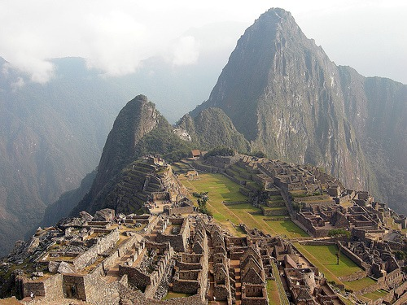

I do not carry dental insurance. I never have and never plan to. My teeth are in great shape. Back in the dot-com days, I got one small cavity after going through a full tin of Altoids every day for over a year. Yeah, I was a sick puppy. That is the only dental issue I've ever had. I don't ever expect to get another cavity, so I don't feel like I need to purchase dental insurance to cover twice a year cleanings. Cleanings are known. I like what Jim said about insurance in the comments of [Healthcare and Price Discovery](/2009/11/healthcare-and-price-discovery/#comment-2821).

> insurance is supposed to cover you in case of catastrophic loss. Current insurance pays common expenses.

My west coast experience is that dentists have tripled the price of teeth cleaning in the past decade. They figured out that they can jack the prices up if they use an insurance company as a middle man. The patient doesn't see or care what the price is. That is unless they pay cash like me. When I used a dentist in Bellevue, they wanted $190 to do teeth cleaning. The madness doesn't end there. I have not found a dentist in America that will clean your teeth without charging for X-Rays and a consultation. Not just the first visit, but annually. **I don't need X-Rays and certainly don't need a consultation where you try to upsell me on nonsense such as sealants.** Humans had healthy choppers for 2.5 million years and now we suddenly need sealants? How about we put down the bagels and Gummy Bears. Problem solved. Weston Price showed us the link between processed carbohydrates and poor dental health in **1939**! I didn't blog about this, but when I switched to a Lake Union dentist last year, I had a blowup. They quoted me $130 on the phone for teeth cleaning. After I got out of the chair, they asked for over $300. I was livid. They explained to me that they did a _special_ cleaning. I blew a fuse and accused them of fraud. They backed down and charged me the normal price for the _special_ cleaning. Going to the dentist should not be a battle for cash-paying customers. Most people dread going to the dentist because of the pain. I do because they are crooks. **Clean my teeth at a fair price and leave me alone. Don't rip me off because I pay cash.** Last month I was due for a teeth cleaning and I knew they would force me to get my annual X-Rays or I wouldn't get a cleaning. Then a brilliant idea popped into my head. I would get my teeth cleaned while in Thailand.  While in Chiang Mai, Thailand, I found 3 dentists within a few blocks of each other. **The price of a teeth cleaning was between 550-700 baht or $16.55 - $21.06!** Nobody wants to get hepatitis in a third world country, so I toured one facility. They walked me through all their sterilization procedures. It was every bit as professional as an American dentist's office. **I got a same-day appointment.** No X-Rays, no asking for insurance, and no up selling sealants. My teeth cleaning was thorough and professional. I thought my $20 teeth cleaning was amazing until I met a woman a few days ago. After hearing my story, she told me her brother got a root canal done in Peru for $20. He is an American. A quick search tells me that a root canal can cost between $400 to $1000 depending on the tooth. You can fly round trip to Lima, Peru now for $450 (American Airlines on Feb 28). The math seems clear to me. See Machu Picchu or make the next payment on your dentist's sports car?  _Photo_ [_Machu Picchu_](http://www.flickr.com/photos/54945394@N00/1335813045/) _by dachalan_

---

## Comments

### DHammy
*December 19 at 2009 at 7:07 PM*

I completely agree--dental insurance isn't really necessary.  Many years ago I told my dentist that I only wanted X-rays every OTHER year (every 2 years) and they gladly complied.  I have never had to remind them either...they tell me when the 2 years has expired.

Like you, I eat very little sugar...  never drink anything with sugar in it and my carbs are way lower than most.  One wonders whether it's really necessary to do a cleaning twice a year.  My dental tech always says I have very little tartar.  Probably once a year would be more than sufficient.  But insurance pays for two a year so I go to two heheh.

---

### Nick
*December 19 at 2009 at 7:53 PM*

Um, yeah, I just had a root canal done, at it was a very complicated procedure.  I didn't like paying $800 for it, but there is no way in hell I'd trust someone to drill down into the middle of my tooth, scoop out all of the dead nerve, and fill it back up with rubber sealant for $20.

---

### MAS
*December 19 at 2009 at 8:38 PM*

I agree Nick.  I'd ask if they'd accept $15.  :)

---

### Ed
*December 20 at 2009 at 6:21 AM*

I've never thought twice about it. My company pays for my insurance and Im glad I have it. I had to get a crown on a mollar last summer and have a few other mollars with fractures so Im going to take advantage of the benefits of insurance since they pay 80%.

But I understand if someone doesn't have it and has to drop dollars over for work done. But I think I side with Nick on this. I wouldn't go to a third world country for anything major.

---

### thomas
*December 20 at 2009 at 7:16 AM*

In India you can get major surgeries done for about 30%  of the cost.  Here's the kicker...the long-term success rate is in the high 90th percentile; higher than in the U.S.  Guess Indian docters come here for the money.

---

### Glenn
*December 21 at 2009 at 12:04 PM*

Nice post.
I haven't been to any kind of dentist for over 14 years. My teeth are healthy and white. What's my secret? Flossing - thoroughly and aggressively - once or even twice a day. About two minutes of pain for the massive pleasure of avoiding dental visit and no cost...

---

### MAS
*December 21 at 2009 at 2:39 PM*

Someone else mentioned to me offline that WaterPik makes a water jet that works as good , but complimentary, to flossing.  I might get one or I might visit another 3rd world country in 6 months.  ;)

---

### que
*December 23 at 2009 at 3:04 PM*

I learned recently that they take the x-ray not only to look for cavities but also to check for periodontitis. In short, if there are too many bacteria for a long period of time between tooth and gum, the constant presence of the body's defense mechanisms start consuming and destroying the bones that hold the teeth. You can avoid that be thoroughly and frequently brushing / flossing / cleaning (how often varies from person to person). I myself haven't had any cavities for more than 20 years, but I didn't know I had the periodontal disease until my new dentist showed me the x-ray. But again, this is different for each person, some people might never have it.

---

### MAS
*December 23 at 2009 at 4:07 PM*

Que - 
That is good to know.  I don't object to all X-Rays, just the annual requirement.  Maybe every 5 years is more reasonable?  I'll ask about it the next time I visit the dentist...while traveling.  :)

---

### Rachel
*May 16 at 2011 at 12:54 AM*

Good for you taking the plunge :)

I love going to the dentist in Thailand. Both the dentists I've had here (I've lived here for almost ten years) are BETTER than the rip-off dentist I had back in Los Angeles and do the work for a fraction of the cost.

My root canal in Bangkok two years ago was about $120. In LA, $900 plus an extra $700 for the cap he wanted to put in my mouth. Needless to say I had a gap there for years as I wasn't about to pay $700 for a tooth you couldn't even see. Then.....moved to Thailand and got the tooth replaced for around $100.

My dentist speaks fluent English, educated in the UK and has a clinic that's probably cleaner than the one I used to go to in LA.

American dentists? Just like all medical care in the US (so stupidly expensive), you can keep it :)

---

### Johan
*April 26 at 2015 at 9:49 PM*

I get pissed when I read this. It's spelled corporatism. Mussolini would be proud in his grave.

Good job Mas! Fight the system be spreading enlightment!

---

### Mike
*May 8 at 2015 at 3:10 AM*

Peru/Thailand dental work:
Don't have to fly all the way there. The town of Algodones on the Arizona/Mexico border near Yuma is wall to wall dentist catering to Americans and Snowbird Canadians.  @ 1/3 the US prices.

---

### MAS
*May 8 at 2015 at 3:57 AM*

@Mike - Good to know. Wonder if Tijuana has similar pricing.

---

