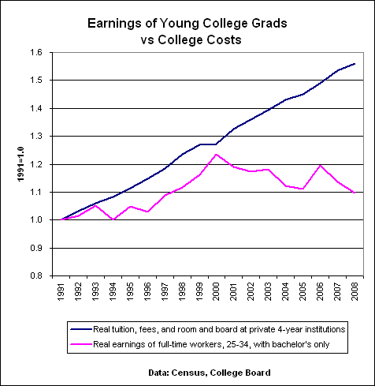

I know several people who are using the recession as an opportunity to pile up more student loans and get yet another college degree. Most are intelligent and qualified to do whatever they want but think they are incapable because more and more professions now are requesting additional or specialized degrees. There is _some_ truth to that, but the sad reality is the return on investment for college continues to get worse. Take a look at the graph below.  Looks like around the year 2000, college costs continued to rise rapidly and earnings stopped keeping pace. Going to college isn't just about getting an education. There are many ways one can get an education. It is about investing in your future earning potential. And one must take into account that not everyone graduates. If you don't graduate, you still have to pay those student loans back. Student loan debt cannot be absolved in bankruptcy. You own it until you pay it off or die. The primary lesson one should have learned from the past decade is that debt sucks. Returning to college to pile on still more debt when the value of the average degree has not kept pace with its costs is often a [poor decision](/2009/07/the-importance-of-college/). Since most students rarely pay for college directly from their savings, the cost is burdened by someone else, be it family, an employer, the taxpayer, or their future self. What would I do if I wanted a college degree and didn't want to become a debt slave? The same thing I did when I was 17. Join the military. Spend 3 years active or 6 years in the Reserves and Uncle Sam will pay for that degree. You'll also become more mature, physically stronger, and more self-sufficient and you'll have served your country. And best of all you won't leave college buried in debt. I just read on the Army website that they even have a program to repay up to $65,000 of prior student loan debt. Seems like a sweet deal to me. Yes, there are risks with the military, but there are non-combat Military Occupation Specialties.

---

## Comments

### Jenn
*January 21 at 2010 at 2:16 PM*

as a current grad student who's current degree  pursuits (MFA / creative writing) will not in anyway increase my earning potential, I can add that one way to not go into debt is to look for programs that offer funding.  Most students in our MFA program work as TAs which currently pays about $1500 /month (which is a living wage in Albuquerque).  

For me the decision was less about the recession (I made this leap before the big one hit) and more about improving my skills as a writer and getting out of a rut.  I've found that being in grad school is offering me access to other opportunities that I wouldn't have qualified for (fellowships, internships, etc) and an opportunity to work with some amazing people.  Bottom line, I'm doing what I love, can only hope that the money will eventually follow.

---

