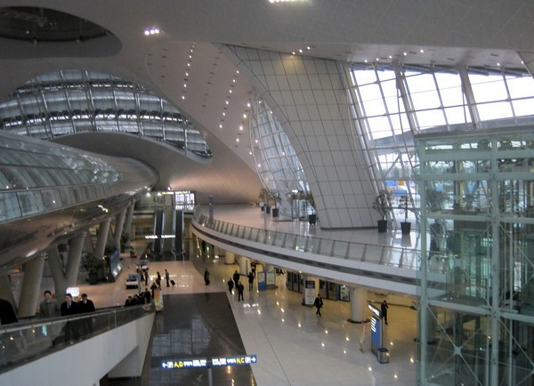

This post is primarily for people who have not traveled outside the United States. When you first enter a foreign country you must present yourself to an immigration officer. They will look over your passport and if a tourist VISA is required, they will examine that too. They may ask you questions about why you are in their country and what you plan to do. And if they don't like the answers they hear, you could be detained. This is their home and they set the rules. Once you make it through Immigration, you will pass through Customs. This is where officers will defend their country from you taking in anything illegal. That might be a firearm, drugs, or even a sizable amount of cash. It is their country and they set the rules. If you don't play by their rules, you could be fined or detained. Sounds scary doesn't it? A bright-eyed American leaves the _Land of the Free_ and ends up in a foreign prison due to some misunderstanding at the airport. The reality is every foreign country that I have visited has had Immigration and Customs officers who have treated me with respect. I understand there is corruption at some land crossings, but it is far less common at airports. During my trip, I went through Immigration 7 times, and only once was I treated like a criminal. Can you guess which one?

1.  Thailand (from Seattle, USA)
2.  Cambodia (from Thailand)
3.  Thailand (from Cambodia)
4.  Malaysia (from Thailand)
5.  Thailand (from Malaysia)
6.  South Korea (from Thailand)
7.  Seattle, USA (from South Korea)

If you guessed #7, you are correct. The immigration lines returning to America were longer than every other line I had gone through combined. The lines were long and slow-moving because everyone was being grilled on why they were here or why they left. I got the same hostile reception when I returned from South America in 2006 as well. Is this how we treat everyone visiting our country? Sad. I got off easy. Some young mother of Latin descent had just arrived on a red-eye got peppered with hostile questions in rapid fire. When her language skills couldn't keep pace with the officer, she got escorted to a side room with her infant child. The officer was some young guy with his head shaved to look tough. _If you want to be tough dude, join the military._  _I breezed right through South Korea Immigration and was on my way._ Perhaps my experiences were not typical. I'd like to hear from other travelers about their incidents with Immigration in America and in other countries.

---

## Comments

### TigerAl
*January 9 at 2010 at 9:04 PM*

Very typical experience for me, MAS and it is is worse for non citizens/residents.  It's a monotonous, low-pay, low-skill job that attracts people who like the power trip.. very similar to the TSA group as well, don't you think?

---

### MAS
*January 9 at 2010 at 11:32 PM*

Because of my common name, I've been inconvienced by TSA database stupidity.  Fortunately I've never had an issue with them directly.

---

### Ed
*January 10 at 2010 at 5:18 AM*

Keep in mind many of these shaved head power trippers could be Iraqi war vetrans. Same goes for security and police officers.

---

### DHammy
*January 10 at 2010 at 1:59 PM*

My experience returning from Mexico by air earlier this year wasn't great, either.  The line to get back into my own country was much longer, slower, and the staff bordering on menacing.  We nearly missed our connecting flight.

This is apparently the price we pay to appease the fearful masses.  Beef up security to preposterous levels to let people get the warm fuzzy feeling of safety.  Of course we're not safer by hassling our own citizens re-entering our country but perception is reality.

---

### Glenn
*January 10 at 2010 at 3:07 PM*

Yup, similar experiences for me. I travel several times and month and U.S. immigration is consistently the worst... 

If you have a U.S. passport travelling outside of the U.S., most countries give you a lot of respect. American immigration officers don't seem particularly to respect American citizens - but as others have pointed out, non-American citizens receive even worse treatment. 

Little by little other English-speaking countries will benefit by attracting more of the best and brightest to universities and high tech jobs.

---

### MAS
*September 15 at 2010 at 8:53 PM*

I encourage you to read I Am Detained By the Feds and the follow -up post.  This guy decided he wouldn't tolerate being treated like a criminal upon his return to the USA.

---

