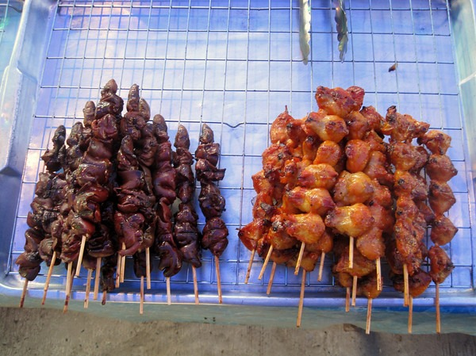

Early in my 4 week trip to Asia, I discovered that slow upload speeds would prevent me from posting my travel blogs in a sequential timeline. Now that I have all my posts finished (finally), I can assemble them in order with links. I **bolded** the more important posts. At the end of the post, I list some of my trip favorites. Seattle, USA

-   [Off to Thailand](/2009/11/off-to-thailand/)

Bangkok, Thailand

-   [MAS and Big Buddha](/2009/11/mas-and-big-buddha/)
-   [**One Night in Bangkok and the World's Your Oyster**](/2009/11/one-night-in-bangkok-and-the-worlds-your-oyster/)
-   [Missing Circuit City at the Floating Market](/2009/11/missing-circuit-city-at-the-floating-market/)
-   [Floating Market Video](/2009/11/floating-market-video/)
-   [Traffic Lights and Menus in Thailand and Cambodia](/2009/12/traffic-lights-and-menus-in-thailand-and-cambodia/)

Chiang Mai, Thailand

-   **[Thai Cooking Class - Chiang Mai, Thailand](/2009/11/thai-cooking-class-chiang-mai-thailand/)**
-   **[Why I Dislike American Dentists and What I Did About It](/2009/12/why-i-dislike-american-dentists-and-what-i-did-about-it/)**
-   **[Elephant Training in Chiang Mai, Thailand](/2009/11/elephant-training-in-chiang-mai-thailand/)**
-   [**Elephant Training Video and Photos**](/2009/12/elephant-training-video-and-photos/)
-   [Here Kitty Kitty](/2009/11/here-kitty-kitty/)
-   [**3 Tigers, 1 Lion and MAS in a Cage**](/2009/11/3-tigers-1-lion-and-mas-in-a-cage/)
-   [Tiger and Lion Videos](/2009/12/tiger-and-lion-videos/)
-   [Chiang Mai, Thailand](/2010/01/chiang-mai-thailand/)

Phuket, Thailand

-   [Phuket, Thailand](/2009/11/phuket-thailand/)
-   [The Phi Phi Islands in Thailand](/2009/11/the-phi-phi-islands-in-thailand/)

Ko Samui, Thailand

-   [Ko Samui, Thailand](/2009/12/ko-samui-thailand/)
-   [Feeding a Crocodile in Ko Samui, Thailand](/2009/11/feeding-a-crocodile-in-ko-samui-thailand/)
-   [Elephant Video](/2009/12/elephant-video/)
-   [Playing Tug of War With an Elephant](/2009/11/playing-tug-of-war-with-an-elephant/)

Siem Reap, Cambodia

-   [**A Holiday in Cambodia**](/2009/12/a-holiday-in-cambodia/)
-   [The Fish Massage - Siem Reap, Cambodia](/2009/12/the-fish-massage-siem-reap-cambodia/)
-   [Floating Village - Siem Reap, Cambodia](/2009/12/floating-village-siem-reap-cambodia/)
-   [Cambodian Landmine Museum](/2009/12/cambodian-landmine-museum/)
-   [**Angkor Wat - Siem Reap, Cambodia**](/2009/12/angkor-wat-siem-reap-cambodia/)

Bangkok, Thailand (return)

-   [**My Return to Bangkok**](/2009/12/my-return-to-bangkok/)
-   [Photo Gallery For Return to Bangkok](/2009/12/photo-gallery-for-return-to-bangkok/)

Kuala Lumpur, Malaysia

-   [Next Stop: Kuala Lumpur, Malaysia](/2009/12/next-stop-kuala-lumpur-malaysia/)
-   [**Arrived in Kuala Lumpur, Malaysia**](/2009/12/arrived-in-kuala-lumpur-malaysia/)
-   [Carbohydrate Observations From Malaysia](/2009/12/carbohydrate-observations-from-malaysia/)
-   [Batu Caves - Kuala Lumpur, Malaysia](/2009/12/batu-caves-kuala-lumpur-malaysia/)
-   [More Carbohydrate Observations From Malaysia](/2009/12/more-carbohydrate-observations-from-malaysia/)

Seoul, South Korea

-   [I've Got Seoul and I'm Super Bad](/2009/12/ive-got-seoul-and-im-super-bad/)
-   [A Rainy Day in Seoul, South Korea](/2009/12/a-rainy-day-in-seoul-south-korea/)

Homecoming

-   [Immigration, Customs and Fearing International Travel](/2010/01/immigration-customs-and-fearing-international-travel/)

Trip Highlights.

-   **Favorite Place:** Chiang Mai, Thailand - Great food and great activities.
-   **Favorite Tourist Spot:** Angkor Wat - Beyond amazing.
-   **Favorite Activity:** Elephant Training.
-   **Favorite Photos:** Night shots of Petronas Twin Towers in Kuala Lumpur.
-   **Favorite Video:** My graceful "_head first_" climb at Elephant Training.
-   **Favorite Food:** Bangkok, Thailand and Chiang Mai, Thailand.
-   **Favorite Airport:** Kuala Lumpur, Malaysia
-   **Favorite Meal:** Baby chicks on a stick in Ko Samui, Thailand for under $1 USD. (on right in photo below)

 Will I return? Maybe, but probably not. I'm the type of traveler that would rather seek out a new destination than return to a place that I've already visited. With that said, I would not turn down a chance to return to Bangkok or Chiang Mai.