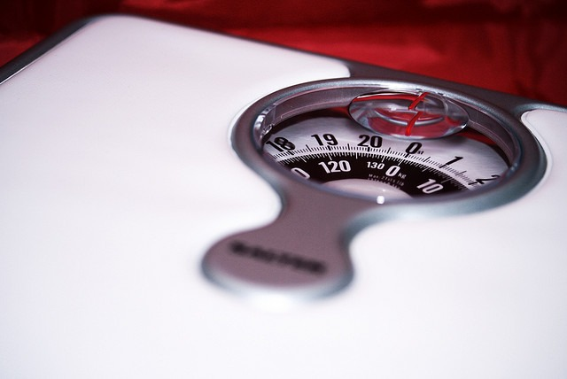

How should guys measure their fat loss progress? There are several methods. Each has its problems, but I think one is a clear winner. Before I proceed, let me state that the overall goal is to **lose fat and gain muscle**. Subway's Jared had an amazing fat loss story, but failed to gain muscle. He became a smaller version of his lumpy self, which is healthier, but not ideal.

### The Scale

The scale isn't bad, but it can't tell the difference between a pound of muscle and a pound of fat. Also, water weight varies a lot, especially in larger individuals. Those body fat scales tend to be inaccurate in the obese and super lean. I used one for years when my body fat was between 15-20%. Once I got leaner, the numbers jumped.  _[Photo](https://flic.kr/p/4XuRev) by Paola Kizette Cimenti_

### Tape Measure (or Belt)

Shrinking waist size is half the goal. Measuring [fat loss with a belt](https://artlung.com/blog/2010/02/27/belt-weight-loss/) or tape measure is superior to the scale, and a tape measure does not penalize muscle gain.

### BMI

[I do not like the BMI](/2009/05/the-bmi-is-still-bs/). The book [Waistland](/2009/01/waistland/) explains in detail why this test penalizes people who are tall, muscular, or African American. I can't endorse this metric since half the goal is gaining muscle.

### Body Fat Tests

Unless you have access to the same person taking your body fat score in the same manner regularly, any given body fat score can vary wildly. Body fat tests usually cost money, but Mark Sisson recently asked his readers to guess his body fat percentage. He has defined upper and lower abs. I guessed 7%. His body fat test came back at 16.9%. His conclusion:

> Sometimes these tests are just plain wrong. And sometimes they can create far more problems than they solve.

### Frankie Method

Frankie was a trainer at a previous gym I went to. Frankie asks the question, "Can you see your abs?" Joe put together a [nice flowchart](https://artlung.com/blog/2010/02/27/belt-weight-loss/). Frankie's method is simple and addresses flaws in body fat testing (see above), but it is probably only valid for the super lean. Most will be discouraged from using his method if their goal is far away.

### The Golden Ratio (aka Adonis Ratio)

In mathematics, the golden ratio is [1.618](https://en.wikipedia.org/wiki/Golden_ratio).

> At least since the Renaissance, many artists and architects have proportioned their works to approximate the golden ratioespecially in the form of the golden rectangle, in which the ratio of the longer side to the shorter is the golden ratiobelieving this proportion to be **aesthetically pleasing**.

A few fitness writers have written on applying the Golden Ratio to the male physique. In an article for Men's Health, John Barben wrote:

> So it's no surprise to learn that chicks dig a physique that measures up to the golden ratio. An Archives of Sexual Behavior study reveals that women are most attracted to muscular men whose shoulders measure 1.6 times the size of their waists.

This is a mathematical methodology for measuring the V-shaped torso. I like this method the best. It rewards both fat loss and muscle gain. The only problem with this method is that you need someone to help you measure your shoulders. The article describes a hack where you measure your chest and then shoot for a 1.4 ratio. Detailed instructions in the article:

> 1\. Measure your shoulder circumference at its widest point -- usually around your shoulders and chest in a line halfway between your nipple and collarbone. (If you're on your own, you can measure your chest at its widest point, just below your armpits.) 2. Determine your waist circumference by wrapping a measuring tape around your abdomen so that the bottom of the tape touches the top of your hip bones. 3. Divide the circumference of your shoulders (or chest) by that of your waist. You don't have to look like a cartoon superhero to hit the ideal proportion: If you use the standard from Swami's studies, you could hit the jackpot by having a 45-inch chest and a 32-inch waist.

True ectomorphs and endomorphs may never achieve the Golden Ratio, but they can try. John Barban wrote this in a comment on AdonisLifestyle.

> True ectomorph and endomorphs may very well have ideals that are skewed towards their ends of the curve. In other words, a true ectomorph may never get all the way up to the ideal waist we have calculated, but they may not need to. Likewise a true endomorph might not get all the way down to the ideal waist but again they may not need to either as they will have bigger shoulders.

The Golden Ratio isn't perfect, but it is the best metric for male fat loss. **UPDATE March 2015:** Once a man gets closer to his [muscular potential](/2014/05/muscular-potential-ideal-weight/), a tape measure is probably the best method for measuring leanness.

---

## Comments

### Joe
*February 27 at 2010 at 9:24 PM*

I'll be looking at the Golden ratio. Cool post.

---

### Will
*April 18 at 2011 at 4:05 PM*

I like the golden ratio method.   I have body fat capilers and scales but they are hard to get consistent results from.  Personally I always fall back onto the good old belt method. 

If I go up in a notch on the belt, I know it is time to get on a diet again.

---

