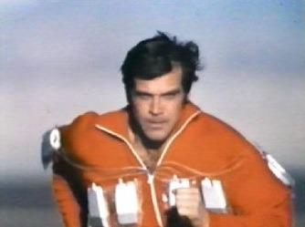

In January, I read two books that advocated using a super slow movement while weight training. One of the books was [awful,](/2010/01/i-wanted-to-slow-burn-this-book/) and one was [outstanding](/2010/01/body-by-science/). I ended my review of the second book with this statement:

> Will I be following the slow motion weight lifting protocol? Stay tuned for a post that explores that debate and my decision.

When I dug into the slow vs normal weight lifting debate, I quickly realized that there was misunderstanding and misrepresentation on both sides. Both methods seem to be valid. Each side is trying to recruit the different levels of muscle fiber. The normal or explosive lifter does this all at once, whereas the slow-motion lifter does it sequentially (according to Body by Science). I want to say that my research led me to the definitive answer, but it didn't. Each side has some smart people. In the end, they both agree on intensity. Translation: high-rep, low-weight training sucks. What did I do? I tried it. For a few weeks, I tried slow-motion weight training. It takes a while to learn how to generate intensity at a slow speed. I'm still learning.  What I did learn was that slow training is boring. I am not alone. That study that the slow-motion group throws around has a backstory. Even though the group had a 50% strength gain, the lead researcher discovered that only 1 out of the 147 people in the study continued training. Most felt it was _too tedious_. Going forward, I will continue using a variety of lifting tempos. The goal is to achieve high intensity with whatever method feels best for me at that time. I will be using slow-motion techniques for leg exercises, such as the hack squat. And because I have long arms, I felt [Doug McGuff](/2010/01/body-by-science/) made a solid case for slow movements on the bicep and tricep machines. Then again, I do recall Art De Vany stating that _training slowly will make you slow, so_ I won't do any exercise at just a slow tempo. What should you do? If you have little experience lifting weights or prior injuries, I can see how slow motion weight lifting on machines could bring you to a higher level of intensity faster and safer than traditional free weights. But if you are already an active person, compound movements using free weights might be better. Just try both and stick with whatever combination keeps you coming back to the gym.

---

## Comments

### Chris
*June 2 at 2011 at 3:56 AM*

What are the names of  the two books?

---

### MAS
*June 2 at 2011 at 4:36 AM*

@Chris - I really liked Body by Science and didn't care for The SlowBurn Revolution.  Since this post was written I have also read and enjoyed this book --> https://criticalmas.org/2011/05/the-new-high-intensity-training/

---

### Yvon
*March 24 at 2015 at 4:47 PM*

Interesting, I have never tried the slow training before.  I do remember back in my football days that our coach wanted us to develop slow and quick reacting muscle.  Along the same lines as the training slow makes you slow idea.  I think a combination of the two could work.  Certain muscles might help to have a slow movement to them.

Yvon Lebras

---

