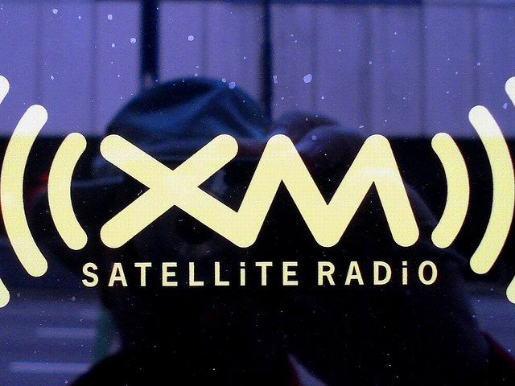

I have been a paid subscriber of XM Radio since June 2004. For the most part I am very satisfied with the technology and programming. However, at the end of this month I will not be renewing. Sirius XM messed up. Here are the reasons I will be returning to terrestrial radio (AM/FM) in March.

1.  After XM and Sirius merged, they lowered the sound quality for online listeners and then had the gall to demand a higher monthly fee to get what was previously defined as part of the service. I paid for a 4 year renewal based off the high sound quality of their online offerings. After they lowered the bitrate, the music stations were unlistenable. Basically they went from near CD quality to AM radio quality.
2.  Poor customer relations. Channels were added and dropped and I never once got an email or letter. The only time I ever got an updated channel listing was when there was a bill. On a few occasions, I emailed stations asking what song they played at a certain time. Only once was any of my emails ever returned. Don't ask your listeners to contact you if you have no intention of responding to them.
3.  The May 2007 suspension of Opie and Anthony for something a deranged homeless man said. The station is marked XL for explict language. That 30 day suspension was uncalled for and showed that XM Radio is a spineless company that cared more about the merger with Sirius than free speech.
4.  Call center in India is unprofessional. I have absolutely no problem with call centers in India. The majority of my experiences have been positive, but not with XM Radio. When I have called XM Radio, it takes forever to connect with someone. Once you get someone on the line, they have music blasting. I was able to overcome the Indian accent, but not with Snoop Dogg playing in the background.
5.  Call center in India deals with sensitive financial information. American laws protect my financial data on American soil. Although India has data protection laws, I do not feel comfortable that I am protected or have recourse if that trust is violated overseas. In other words, I will not be reading a credit card number to anyone that is not in America. Tech support, no problem. Financial transaction, no way.
6.  The most important reason is that XM Radio has fraudulently charged my credit card twice, lied to me and has not apologized or made peace with me. I was forced to cancel my credit card number and file fraud charges on them. The full details are on the post [Filing Fraud Charges Against XM Radio](/2009/05/filing-fraud-charges-against-xm-radio/).
7.  Seattle has at least three good commercial free radio stations on the FM dial. 88.5 has dance music, 89.5 has jazz when NPR isn't on and 90.3 has a killer selection of indie music. There may be more good stations, but I haven't ventured past 90.3.

There you have it Sirius XM. I predict your company will go into bankruptcy. When people like me that have been early supporters and die hard backers of your technology walk away angry - you have problems. After you go through bankruptcy, fire Mel Karmazin, bring the call centers back to the States and emerge as a new company I might forgive you. Until that happens, you're dead to me.  _[Photo](https://flic.kr/p/4DiZ68) by Tom Magliery_

---

## Comments

### TigerAl
*February 12 at 2010 at 6:08 PM*

Good choice ending the contract there MAS, for 2 reasons based on your experiences:

1.  There are very good outsourcers in India that have competitive costs, high quality, training and employee satisfaction.  Then there are the very low cost awful ones that do not invest in quality, training or employees.  They exploit kids graduating from college, give them more than the newbie starting wage with the result that a large number of them have serious psychological issues after being yelled at all day by angry customers.  This has apparently become a significant issue in call center hub cities.  Sirius has obviously made the choice to optimize for their bottom line at the expense of their customers.

2.  Based on my  experience running call centers, I would not recommend giving your credit card number over the phone to anyone, either inside the US or outside (and sometime it is hard to tell the difference).  It's better to use a secure online system to enter that type of information.  The person handling a complaint/question on the account (for most e-tailers) and doing security verification usually cannot see the entire number so would not be able to steal it.  If you have to give out a number, a lot of CC companies now offer the alternative/encrypted number as well as fraudulent charge protection.

---

### Joe
*February 12 at 2010 at 7:19 PM*

Wow. Big step for you. I know how much you love the hot talk radio. Will you simply go without?

---

### MAS
*February 12 at 2010 at 7:31 PM*

I've begun listening to podcasts more and more.

---

### Berry
*February 15 at 2010 at 6:47 PM*

I have had my radio out for the past few days (fuse?) and feel like a Sirius Junkie because I miss it so much!
P.S. If you like Sirius XM then see their “rags to riches” story on DVD. The movie is called “Stock Shock” and it goes over the history, development, and near-death experience of the stock. I did not know the inventor of sirius xm was a woman!–well she is now, at least. DVD is cheaper at www.stockshockmovie.com, but the DVD is pretty much everywhere for sale.

---

### Eric
*February 23 at 2010 at 11:04 PM*

I couldn't agree more. As a five-year subscriber, I am canceling my service. I just don't feel that they have done anything to support all of the price increases over the years. My price keeps going up and I get less (no Internet). I just can't come to grips with paying $15 for radio content. At this point, I have found a ton of alternatives online, streaming stations with good content. Not too mention, there are a ton of stations on Shoutcast and Live365 that simulcast the better Sirius content.

I just talked to someone today and informed them I wasn't renewing. He asked me why and I told him the price. I told him that I recently saw an introduction special for $4 a month for new subs and I'd stay if I could get that. He said no and there were no other offers he could make. I said, well either I can cancel my account, and re-open another one for $4 a month or you can just meet the price. Why reward someone that hasn't listened and not a 5-yr subscriber? He said no, so I just said forget it. I'm not looking for a handout, but the price doesn't support the product anymore. There are plenty of other options online at this point. I just found it funny that he would rather me cancel my account and chance that I won't come back (I won't) than just meet the price. Pretty ridiculous.

---

### LRS
*March 30 at 2010 at 4:03 AM*

Yeah... Sirius had me hooked. Till this latest endeavor that is. I had 5 cars and a marine application with them. In all I have been spending nearly $1000 a year.

Last August my wife and I sold our VW Tourag back to Mid Western Auto Group as it was in the shop more in the 364 days we had it than in our garage. I canceled Sirius service on August 27th, 09. On September 6th, 09, Sirius auto billed me for $110. Just found out about it March 29th, 10. No refund given.

This is not the first time I had an experience like this with Sirius. After a conversation with a supervisor it was resolved the last time.

This time after sitting on hold for 47 mins, I was called a liar and charged $75 for canceling that service and $15 to transfer service from another car I just sold to one I just bought. I requested to speak to supervisor. After 15 more mins on hold and a lengthy conversation this was reversed.

I previously had asked not to have auto renewals as I change cars out a lot. After reviewing my account I found 2 other charges for someone elses accounts (nearly $300.) another hour on the phone to straighten out.

Could barely understand guy on other end as he had thick accent and kept breathing heavily into his mouth piece. Also, if I hear one more JAZZ song while on hold I am going F#@KIN' POSTAL!

Now I have found out that their marine program does not cost $149.99 a year as I was told by the dealer. In all, it cost $321.02 a year! My boat is in the water (Lake Erie - Ohio) from May 15th-Sept 15th and is used 20 hours a season. That is about $16 an hour. The real problem is their satellite only works about half the time and weather is ALWAYS WRONG!

But what pisses me off every 5 mins is the commercials we SUBSCRIBERS are PAYING to listen to. Sirius was suppose to be commercial free... guess not. Screw your clients - screw yourself.

I will not be renewing any further and have closed the credit card they have on file and that they would not remove unless I gave them another good account.

Good bye Sirius - XM

---

### Dmaxer
*June 25 at 2010 at 6:29 PM*

I too am a victim of XM/Sirius fraudulent billing.  I bought a 3 year subscription in 2007 for my new vehicle for $360.  In late Feb 2010 I got a mailed reminder from XM that the service was expiring soon and I had until Apr 1st to renew.  So, just after mid-March I phoned their (India) call center.  I was offered a lifetime subscription for $460.  I told the guy I needed to know what my ability would be in the future to transfer the subscription to another radio.  He said I would be able to move the subscription a total of three times to other radios.  I told him based on that assurance, I would buy the subscription and gave him my cc number.

A little over a week later, I received a mailing from XM with the fine print statement describing their service.  It said that vehicle radio subscriptions generally cannot be moved to another radio.  Only subscriptions for portable radios can be moved. I checked my credit card account and saw that XM had not yet billed me.  I called XM on March 31 and told them I had been deceived or misled about the transferrability of the subscription.  I asked them to check the recording of my phone call to them for the evidence, cancel by request for a subscription, shut off service to my radio at the end of the 2007 subscription and not bill my credit card.  XM's agent acknowledged my complaint and said they would recommend to the head office that my request be honored.

Over a series of telephone conversations with XM, a number of increasingly strange offers were made to me for service but I never got one I could really accept.  Ultimately, XM billed my credit card for just  over $351 (I can't explain the amount). I phoned my credit card company and disputed the charge.  They investigated, agreed with me and refunded the charge.

Now XM has sent me a bill for about $285 (I still can't explain the amount) that includes a $5 late fee.  I will dispute that bill directly to them, but I have the feeling this saga will continue.

What a POS!

---

### Ezekiel
*December 1 at 2010 at 9:32 PM*

I am also a long time subscriber and I just got off the phone with the India call center.  I no longer need the land radio as I have been listening to Sirius XM on my Ipad.  So I told this woman this and when I got off the phone she had canceled my online account because it was connected to the land radio.   Very miffed not canceling but I am pissed.

---

### Jon
*February 2 at 2011 at 6:39 PM*

I am a lifetime Sirius subscriber and enjoy the service. I recently purchased a new car with a XM radio. I was assured by the dealer that it was the same company and I would be able to transfer my subscription. After contacting both Sirius &amp; XM I am frustrated and angry. Their customer service model is based on extracting every last bit of money possible. Customer satisfaction &amp; loyalty aren't even on their screen.
Has anyone out there found a way transfer a subscription between the two and if so, what are the magic words?

---

### Drew
*February 20 at 2011 at 1:59 AM*

Sirius-XM customer service is unprofessional and outright rude. I was being mistreated by their support in all kinds of ways that is too long to describe here. They refuse to mail me a receipt for every charge on my card. They also declined to send email receipts. Email receipts for God's sake! They don't realise how crappy their new player is. I just got logged out in the middle of interesting programming and being unable to log back in I spent 1 hour with less than knowledgeable support guy until I was able to log back in, but the programming was gone with the wind. Once you (every 1-2 hours) get logged out, you must log back in by typing your full email address again. Used to be easier to log back in. They should not log us out in the middle of news etc. Signal quality in the last several months deteriorated so much for the online service that I started losing signal for 3 seconds every 10 seconds. No kidding. Finally I called them and canceled my online player. Next time I will cancel the car radio as well.

---

### Jackie
*April 22 at 2011 at 2:58 AM*

Customer service is horrible.  We had XM in both our house and the car.  In November of 2009 we called and cancelled the subscription for the house.  In February of 2010 we received a notification in the mail that the credit card on file had expired.  When I looked at the statement it was for the radio we had cancelled.  I attempted to call customer service and spent quite a long time fighting with the automated systems.  Never could get to the right place.  Finally kept hitting the 0 key on the phone and eventually somebody would pick it up.  I asked why they hadn't cancelled our subscription and was told it was computer problems.  In June of 2010 we received a statement in the mail explaining our services with XM.  This also showed we had 2 radios and 2 subscriptions.  I called again -fought the automated system again and got somebody else on the line.  They informed me that they would do something about the cancellation.  In late September of 2010 once again I contacted XM after again being notified the credit card on file was expired.  I was told again that there were "problems" getting accounts cancelled and they would "try" to get this done.  In October of 2010 I called because we had sold our vehicle and I wanted to cancel that subscription.  Got a very rude man on the phone.  After 45 minutes going back and forth; being told I had to contact the cancellation department (that was the number I had called); they finally seemed to understand it.  I no longer had access to the website and finally I no longer get notices that the credit card on file has expired.  Unfortunately they refused to refund all the money from the time I originally contacted them to cancel in 2009.  They need to get rid of the stupid call center; get rid of automated systems that don't understand a word you say.  This started out being such a good deal...boy did it turn out to be a horrible deal.  If ever we sign up again it will be without a credit card.  They can receive a check in the mail like everyone else.

---

### Joe
*July 11 at 2011 at 11:07 PM*

I also  got screwed by Sirius. Bought a new car in 2009 and received a 2 year subscription from GMAC...free. Came with the car along with 2 years of OnStar. It just so happens that I had subscribed to Sirius for my wife's car in the summer of 2009 (for her birthday) and canceled a year later in 2010. Now, I get charged on my Discover Card (same card I used for wife's car) for renewing the new car subscription. Talk about fraud.

---

### Andrew
*July 11 at 2011 at 11:42 PM*

Every time Sirius XM charges my card they increase the fee. They will not send me a prior notice to raising the fee nor they will ever mail or email me a credit card receipt (!!) and an invoice (at least a credit card receipt!?)  even if I asked for a receipt many many many many many times and I was promised many many many times! Never happened! I am calling them right now to CANCEL forever. USA companies do not know what customer service is!!! Therefore USA e-CON-omy will be gone soon to the dogs.

---

### Thomas
*April 17 at 2012 at 3:06 PM*

U think India is a bad call center, I got Egypt last week, when my subscription expires in 3 months I will not renew. Can't imagine giving my card info to anyone in a country that hates u and treats women the way they do, how does sirus even support this

---

### MAS
*April 17 at 2012 at 3:10 PM*

@Thomas - I did not know Egypt was now a call center hub. I found this article on the topic.

http://www.callcentrehelper.com/outsourcing-is-egypt-the-new-india-5.htm

---

### Andrew
*April 17 at 2012 at 3:52 PM*

They just raised my quarterly fee by $5 again, without any early notice, no invoice, nothing, just a charge on my card for $5 more. When I tried to contact them there was no response. I'm only keeping this Syrius XM so I can listen to BBC and some good rock, but increasingly the BBC News are all about "how many got killed" and I can listen to my rock on a CD on my demand, not what they "send" me. So I feel the farewell is coming soon...

---

### Andrew
*April 17 at 2012 at 3:54 PM*

India is not bad, they just don;t care about some "rich" "American" 8000 miles away. Regarding Egypt I don't think they hate USA in any way, but I think American arrogance will have to end at some point, so you get your face and your dignity back and stop calling other countries "third world".

---

### MAS
*April 17 at 2012 at 4:10 PM*

@Andrew and @Thomas - I suspect the billing problems with Sirius XM are unrelated to the call centers. I'll know soon enough. The XM Fraud post has been getting comments now for 3 years.
https://criticalmas.org/2009/05/filing-fraud-charges-against-xm-radio/

If the comments stop coming, then maybe things are being fixed. I've been away from Satellite Radio now for 3 years. All is well.

---

### Jamalo
*June 26 at 2012 at 8:05 PM*

Sirius now has a call center in Egypt, Egypt?  This is where these egyptian idiots just put a Taliban as president and now I am suppose to give an Egyptian my credit card number.  I am better off giving it to the guy on the street...  No wonder Sirius and XM are on the brink of going under, with these idiot business decisions.

Now I have to give my number to a bunch of terorists in Egypt???  INSANE

---

### Lor
*July 11 at 2012 at 1:28 AM*

XM customer service is still just as bad as ever. We never gave them a credit card number (thank heaven) and paid by check. We paid off the last bill and called in to cancel our service back in April 2012. Just got another bill so we called them again. They said that because we paid them in full, they just automatically renewed the subscription even though we had cancelled. They said that we would have needed to call back a second time because their departments don't talk to one another - that they don't have e-mail. Yeah, right. The best part is that even though they renewed the subscription without telling us, they didn't resend the signal so we thought all along that it had been cancelled like we asked. When I told them that what they were doing was a scam they offered to lower the bill to $20.00. As if we actually owe them something. I filed a complaint with the BBB but I doubt XM will care. Buyer beware - they're real creeps!

---

### Andrew
*July 11 at 2012 at 2:06 AM*

Guys! I found out from a reliable source that Syrius XM is cooperating with the US government tracking people down wherever they go, just like the cellular (mobile) companies nowadays do. You're paying for being tracked by Uncle Sam and that's un-con-sti-tu-tio-nal, as my attorney just advised me.

---

### MAS
*July 11 at 2012 at 2:13 AM*

@Andrew - I don't believe that is true. Your receiver has no way to transmit.

---

### Andrew
*July 11 at 2012 at 2:21 AM*

@MAS - the little dude inside of the radio itself transmits all your news back to the Sammy's Club. Works just like a cellphone.

---

### jm
*September 2 at 2012 at 2:39 PM*

Don't know if Michael Allen Smith or anyone else will read this or not -but here goes... I'm a Howard Stern Show fan and that's the Only reason I got Sirius/XM. I found a few other (entertainment) talk shows that I enjoyed very much. My last receiver "died" on June 2011 -I heard from Multiple sources on the Sirius/XM customer service line (all Canadian, for what it's worth) that the average life span of these units is approximately 2-2.5 years (!!?). Long story short -I've found almost all my old FM talk favorites now have Free Podcasts! I just got 7day free trial of Sirius/XM, but don't know yet if I'll resubscribe w/them. If your reading this: just go to the App store or look online and you'll find a Ton of Free places to find music &amp; programming! Much of what I've found is Free &amp; there are Free Podcasts galore! This past year w/out Howard Stern has been frustrating for me personally, but I'm also hearing Michael's statements Loud and Clear. The Sirius/XM business model has Never made sense and their own talk hosts (including Howard) have expressed that very opinion! I just hope that if/when Sirius/XM goes belly-up that the talent quickly finds their way online &amp; to Podcasters everywhere. PS: the only reason call centers exist outside the US is to save the Corporations from paying fair wage &amp; benefits to workers here. You should look online &amp; you may find a simple map application that shows you how many businesses you frequent are still outsourcing jobs today. This IS a major factor in the US economic decline! F*^k India -the last time I dealt w/one of their call centers, I lost $40 &amp; Never got the item purchased or a refund. The company here had No record of the transaction! Enough.

---

### MAS
*September 2 at 2012 at 2:43 PM*

@jm - I do like programming and fidelity of the Sirius XM. My only issue with them is their fraudulent billing practices.

---

### John
*September 2 at 2012 at 2:56 PM*

Report them to BBB, FTC and some kind of fair competition bureau. I do not buy from businesses who defraud or cheat its customers in any way.

---

### JDM
*September 8 at 2013 at 3:23 PM*

SiriusXM has no intention of changing their billing practices. The sucked in the past, they suck now, and they will continue to suck until someone else purchases them. 
If you have to deal with them: Remove your CCard info with them. I have done as much as cancel the card number they previously held. They cannot be trusted.
Stick with the snail mail invoice that they charge 2.00 per invoice for. Believe me, it will save you hundreds down the road. Insist that all payments are one time payments. Better yet, send them a check. 
Always, ALWAYS call them a week before your subscription is up. This is the best use for a calendar you will ever have other than your favorite Aunts birthday. You must CALL them before the subscription is up. Your must DEMAND you want your service disconnected or that they charge a price that is worth what you get out of the service. I pay about 55.00 for premium and the info package for weather and traffic. That is total. After taxes. That is what I write the check for every 6 months. If you let them, they will try and get you to pay more than double that. YOU MUST TELL THEM YOU WANT TO DISCONNECT. I use 2 channels. The service is not worth 2-300.00 a year for 2 channels. You may feel different. 
You have to do this every 6 months. They are unethical pigs. I have had their service for many years. Anyone that says their service is good and that they have had no problems either has not dealt with them long enough OR they just don't care where their money goes. 
Just look at your agreement every time you renew. It includes a statement (actually it's a contract) of how much they are going to hold you responsible for in the NEXT BILLING CYCLE! Who does this? That amount, by the way, is list price. So if you do not call before your renewal date, they will tell you that you already owe. DO NOT wait to the renewal date to call and tell them what you will pay.
I have never held passion this negative for any company in my 57 years on this earth. I wish I did not have to use them at all. And as soon as the cell data gets just a bit better, I think we can all start streaming audio in our cars and put these guys under, where they deserve to be.
And just so you know, I am not a 20 something, city dwelling, the world revolves around my half bedroom apartment and the Starbucks 2 blocks down the street, person.
I am an old, rich, republican white guy. I protect capitalism and free market anywhere I can. These guys suck. They suck bad. Worse than any phone company, worse than any insurance company we have ever had to deal with in this country.
Do not hand out your money to SiriusXM without making them pry it out of your hands. Their business ethics deserve this treatment.
It is possible for them to change. I don't see that happening.

---

### Northern
*September 8 at 2013 at 4:50 PM*

Wow, oh those North Americans, so spoiled by the money, by the tinseltown, so demanding, so competitive in attitudes, so spoiled, so demanding, so arrogant, so me-me.... why don't you relax and take a deep breath before you start spewing your infantile demands all around you like overgrown kids. Yes, I've noticed some not so perfect practices by some companies, including Syrius XM, but I take it easy and don't let the heat hit my brain. Ah, but I'm not a North American. Not so spoiled. I'm more accepting of a wide range of cow manure and if I don;t like something, I simply cancel and ask kindly for a refund.

---

### MAS
*September 8 at 2013 at 4:57 PM*

@Northern European - Thank you enlightened European for blessing us with your wisdom. As for kindly asking for a refund, you may have missed the first post which offers more explanation.  

https://criticalmas.org/2009/05/filing-fraud-charges-against-xm-radio/

---

### Northern
*September 8 at 2013 at 5:27 PM*

@MAS: I've been with XM Radio (then Syrius XM) since 2005 and I've had my rate increased every year or so without a prior consent until I noticed in their terms that they reserve the right to charge ever-increasing rates without prior authorization.  That made me slightly upset a couple times, but now I'm calm and I will cancel my service only once the amount becomes unreasonably high. One car here, only. No big deal. 

My post is not applied to your specific case,  but to the people who complain a lot. I hate fraud and as a consumer I fight it as well. I've been selling to North Americans and I know how demanding and complaining they can be, but also how easy to satisfy they can be as well. Sometimes too easy, sometimes too hard. And I satisfy all demands, including unreasonable, and unfair ones, and I make sure I provide extras to keep all customers happy, even those who call me at night to inquire about their $5 order and pay $2.50 to overnight it. The larger the order the less the person usually complains. The smaller the purchase the more demands and complaints originate from the customer. That's the rule in any business. Everyone needs to make a living, but FRAUD is unacceptable. Unreasonable complaints are also unacceptable if they are really unreasonable. Again, this does not necessarily apply to your case or to your entire case.

---

### Michael
*October 2 at 2013 at 12:20 AM*

I agree with the original post 100% but I have a few different reasons for alas, SiriusXM and I parted ways yesterday...

1: Cost. I got the free 6 month subscription when I purchased my new car in 2010. Original cost was a little over $100 for the 1st year after. Travel Link was $50 &amp; I could listen on line for free.
The bill I received in the mail year yesterday was for $264.08 for the three - $34 of that was to listen online. Quite frankly, I listen to my iTunes more than anything now.

2. Not a big fan of automatic renewal. This practice works for them- not me, their customer.

3. Unlike the original post, I in fact have a problem with companies using call centers overseas. It takes away American jobs and cuts operating cost to drive efficiencies that in this case helps their bottom line and isn't passed along to the consumer. I waited on hold for 30 minutes before I finally spoke to "April". I told her on no less than 5 occasions that I wanted to cancel and she kept coming back with a lower price. Final cost was $56 for the radio only. By that time I was pissed. If they can offer a $56 annual cost this year, they could've gotten away with charging me that price all along. Fortunately, I did get a confirmation number for my cancellation of service.

4th &amp; finally, my biggest irk with them is they claim to be commercial free yet the comedy stations run commercials regularly. I did however, get a good laugh at the ads for male enhancement products the 1st 400 times I heard them. The biggest culprits are the famous Mtv VJ's from the 80's. They love to chat at length in between songs and especially over the start of a new song about how they did this or how they did that back when they were on the air. Nobody really gives a flying you know what, just shut up and play the music that I paid for! Can't they just run a computer program to play the music and fire them all?! 

I guess that would save them even more money and they would still overcharge us for shitty service...

Not this guy- I'm done!
M.

---

### Dr
*January 4 at 2015 at 10:36 PM*

How about how they just took Channel 75, Classical Pops off -- no notice, no replacement
Whoever is programming the only remaining station Classical 76 must be some sort of
fan of the weird - lots of cacophonous horrible stuff like Vaughan Williams, Telemann etc

I sent a note to one of their hosts on 75 who was most gracious and responded promptly
but said in essence "He just works there" and had no more notice than I got-

All this to be insulted by their "customer service"?

---

### Fed
*January 18 at 2015 at 6:21 PM*

I refuse to give Sirus Radio my credit card information to continue my subscription. I got a call today and could not understand anything the woman was saying because her accent was so heavy. After repeating it three times I said forget it just cancel it is to expensive and she continued to say the same thing over and over. Finally I just said I cannot understand a word you are saying forget it so she transfred me to the manager who was a bit more understandable BUT stil had a heavy accent. I asked where they were calling from and he said Egypt. Now come on people do I really want to give my information to someone in the Middle East with everything that is going on. Bring those dam jobs bak to USA and maybe I will re subscribe.

---

### don
*February 12 at 2015 at 11:55 PM*

when I first got satellite radio it was great. However when it came time to renew I was not impressed with the billing practices. That on top of sick larger male enhancement commercials on the comedy channel prompted me to forget satellite radio and cancel my subscription. My sister offered to buy me a subscription as a gift so we tried it but my car radio was not working properly. I had to call them and told them the radio antenna wasn't getting the signal. A couple days later I called again to make sure they cancel my subscriptions. I was a shirred the subscription would end at the end of the month. Now it is February it should have been ended in December but I just found out they're still charging. I was actually going to hook up my radio because I'm going on a trip. When I talk to customer service and they pulled up my account they told me the car was still subscribed. I don't trust the company I will have to cancel my credit card. I don't mind outsourcing I like the idea of building economies $100 in India or Egypt goes a long ways as compared to here. But I don't like the company treating me and all the other customers like meat. I wish they had a marketing analysis done and wanted to make great product.

---

