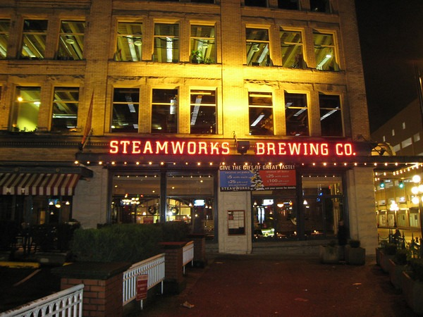
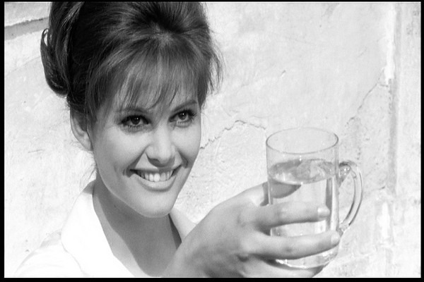

Until I had Sam Adams, I didn't believe that beer could taste good. It opened my eyes to a world of beer in a way that local roasted coffee opened my eyes to quality coffee. When I arrived in Florida, a co-worker took me to the [Oak Barrel Tavern](/2008/03/ybor-city-scrapbook-1994-1998/), which had 35 beers from around the world. From there I progressed to the microbreweries.  _Steamworks Brewing Co in Vancouver, BC_ In a matter of 4 years, I went from disliking beer to planning my travel around visiting microbreweries. For over a decade, I went to numerous microbreweries. I almost always tried the sampler tray. From the Blonde Ale to the Imperial Stout, if a beer was well brewed and unique, I enjoyed it. I've been to microbreweries as far away as Kennebunkport, Maine and Auckland, New Zealand. It was fun, but it is time to say goodbye to beer. There are 4 reasons why I've decided to stop drinking beer.

1.  95% of the offerings are no longer unique to me. I've tried hundreds of stouts. The odds that the next stout I try is going to amaze or even impress me is becoming more rare. Brewpubs tend to offer poor food choices. If the beer isn't impressing me and I don't care for the food, then why am I still seeking the next great ale?
2.  Hops are highly estrogenic. [Estrogens](/2009/04/revisiting-the-warrior-diet/) are not good for testosterone levels.
3.  Gluten intolerance. I am pretty sure that I have some level of gluten intolerance. Mine surfaces as screaming headaches. Since going mostly [paleo](/2009/01/maybe-i-think-too-much-but-some-things-wrong/) in my diet, whenever I go back to any food with gluten, I get brutal headaches. While in Thailand, I took a break from the great Asian cuisine and had pizza. It crushed me like I drank 3 double IPAs.
4.  Carbs. I don't need the carbs. I prefer being lean to the taste of ANY beer.

My last beer was in September, so this post isn't the result of weekend activities. People have asked me about wine. I have had headaches with wine as well, however when I think back to the times I've had wine, it was usually when I had gluten rich foods such as bread and pasta. Maybe wine would be better for me, but I'm not that motivated to try any alcohol at this time. Water is fine with me.  _From the movie 8 1/2_

---

## Comments

### dhammy
*March 8 at 2010 at 7:48 PM*

I gave up beer about a year ago after having an upper GI and having to go on omeprazole with a hiatal hernia and GERD.  I was just starting to really get into the expensive foo-foo beers...microbrewed porters/stouts/etc.  

Long story short: I haven't really missed them much.  And my health is better than ever.   

Kudos to you.

---

### Matthew
*March 8 at 2010 at 10:40 PM*

You can cross #2 off.  While hops contain 8-prenylnaringenin, which had activty greater than or equal to other plant estrogens, the levels and types of estrogens that are actually found in beer were not found to much of an effect the concentration of highly estrogenic compound previously mentioned was on the order of dosing yourself with microgram of estradiol per liter of beer you consume.

---

### MAS
*March 9 at 2010 at 12:56 AM*

"Hops is perhaps one of the most powerfully estrogenic plants on Earth. Just 100 grams of hops (about 3.5 ounces) contains anywhere from thirty thousand to three thousand IUs of estrogens, depending on the type of hops. Most of it is the very potent estrogen estradiol.

The estradiol in hops has been found to directly interfere with the ability of the testes Leydig cells to produce testosterone."

source: "The Natural Testosterone Plan" By Stephen Harrod Buhne

---

### MAS
*March 9 at 2010 at 1:39 AM*

The book <a href="https://criticalmas.org/2009/10/the-anti-estrogenic-diet/" rel="nofollow">The Anti-Estrogenic Diet</a> disagrees.  It makes a strong case that hops are estrogenic.  

I'm not a scientist, so I can't tell you if the studies in Ori's book are better developed than the one you found.  What I do notice is male beer drinkers carry excessive weight on their mid section and develop man-boobs.  Go to a WABL (WA Beer Lover) meeting if you disagree.  That is a sign of too much estrogen.  Regular non-drinking fat people, carry their fat more evenly distributed.  That is a 20 year observation and not science.  

Does midsection fat come from the estrogenic beer they drink or all the stupid food choices they make while drinking beer?  Does it matter?

Show me someone over 40 that regularly drinks beer and has ab definition.  Not Miller Lite, but real beer.

---

### Mike
*March 11 at 2010 at 5:24 AM*

Hi guys...new to reading this site.
Looks like Mr. MAS has a lot of time on his hands researching....here's the main challenge of our middle aged male lifetimes:
Figure out how to avoid BPH (benign prostate hypertrophy). There's no point in living to 120 with a flat abdomen and big biceps if you have to pee 5 times a night and 15 minutes after drinking a cup of coffee yet it is going to happen to 80 percent of us.

---

### MAS
*March 11 at 2010 at 4:45 PM*

One of the respected nutrition sites I follow Animal Pharm had a <a href="http://drbganimalpharm.blogspot.jp/2009/04/gene-environment-interaction-get-into.html?showComment=[phone removed]672#c[phone removed]212212114" rel="nofollow">comment</a> that addressed your question.  

"Any antiinflammatory, insulin-controlled diet (like Paleo) helps BPH. Studies show vitamin D and fish oil are very benefitical in controlling BPH has well."

It appears all roads to optimal health led to cutting carbohydrates, increasing Vitamin D3 and increasing the Omega-3 to Omega-6 ratio.

---

### Mike
*March 12 at 2010 at 5:19 AM*

Mr. MAS:
I agree with you on paleo. I was on the strict Atkins diet for several years in the mid 70's, ketosis and all. No question that it works: body fat &amp; hunger disappears. An additional benefit: better erections. The only problem was extreme dietary boredom.  And after a while I questioned the wisdom of being in ketosis the rest of my  life so gradually fell off the wagon.
As to BPH, the closest people on a paleo diet that I know of would be eskimos living the traditional life on sea food. But they probably don't exist anymore having added cheetos and beer to their diets.  Too bad...it would be interesting to see if they had better BPH outcomes.

---

### MAS
*March 12 at 2010 at 5:30 AM*

Mike - 
I don't think ketosis is even necessary.  It certainly works, but for me a slow gradual reduction of carbs has been enough. 

As for dietary boredom, with the Internet there are far more resources for ideas.  Didn't have that in 1970s.  I still do curries and stir-fry dishes only without rice or noodles. 

The paleo blog crowd is growing quickly.  When I first looked at it a few years ago there were a few resources.  Now there are many.

---

### Glenn
*March 12 at 2010 at 11:25 AM*

As they say:
"Being lean feels better than beer tastes"...

---

### Mike
*March 13 at 2010 at 4:12 AM*

Yes...paleo..sounds great now..but one has to address the ethical issue of eating animals and fish.  Wild fish are disappearing fast e.g. salmon and tuna; sharks are horribly mistreated for shark fin soup.
Factory-farmed animals are treated disgracefully and probably not good for us what with antibiotics, food additives, hormones, mad cow disease ....  The few farms that process their animals for food ethically without dancing around the FDA rules are few, hard to find, and unlikely to be able to produce enough for everyone.

---

### MAS
*March 13 at 2010 at 4:19 AM*

I don't know about what would happen if paleo diets were adopted by everyone.  It really hasn't been an interest of mine.  

I have had no problem getting grass fed high quality meat in the Pacific NW.  Farms like Thundering Hooves do neighborhood delivery a few times a month.  

My seafood intake has dropped for some of the reasons you mentioned.  It is now easier for me to buy clean land animals than clean seafood.  The exact opposite was true just a few years ago.

---

### dhammy
*March 15 at 2010 at 1:02 PM*

I've given some thought to the idea of sustainability of the paleo diet.  Without doing any real number crunching or analysis it would appear obvious that 6 billion people wouldn't be able to live like that.  The sole reason that there ARE 6 billion people on the earth is because of agriculture and grains--although they are imperfect sources of nutrition.

This is why you'll never see any prominent public officials (like the surgeon general) promote such a diet.

---

