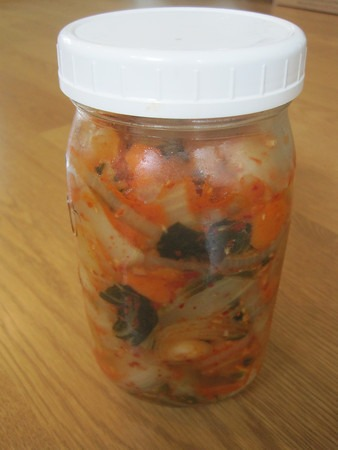

_UPDATE October 2011: I no longer use the Brine method described in this recipe. Instead, I prefer the "Rub in by Hand" method, which I outline in the post [Kimchi 101](/2011/03/kimchi-101/)._ 

#### Ingredients

-   1 - 1.5 tablespoons of Redmond Sea Salt
-   4 cups of spring or filtered water
-   1 pound bok choy
-   2-3 carrots (optional, adds sweetness)
-   1 large onion
-   4 garlic cloves
-   2 tablespoons of dried red chili flakes
-   2-4 tablespoons of fresh chopped ginger

#### Instructions

1.  Mix salt and spring water until most of the salt is dissolved. (the brine)
2.  Chop the bok choy into large bite-size pieces.
3.  Slice carrots too.
4.  Submerge bok choy and carrots into brine for 3-5 hours. Use a plate and weight to weigh the veggies down. They must remain underwater. It is OK to add carrots later, this step is mostly for the bok choy.
5.  Chop up onion and garlic. Grate ginger.
6.  Drain the brine. Doesn't need to be perfectly dry. Save a little bit in case you need to top off the jar.
7.  Add the onion, garlic, ginger, and chili flakes into the bok choy/carrot bowl. Mix well.
8.  Stuff mix into a glass jar. Pack tight. Get your hand in there and push down. Pack it tight!
9.  Cover with cheesecloth or paper towel.
10.  Once a day for a week, push down on the kimchi. Force the air bubbles up and out.
11.  After 5-7 days, cover and move to refrigerator.

---

## Comments

### TigerAl
*April 19 at 2010 at 3:28 PM*

Slightly off topic since I saw that you had Redmond Sea Salt in your recipe.  
My new favorite seasoning is truffle salt.  Just a little sprinkle (it is really strong, btw) on poached or over-easy eggs makes them absolutely fabulous.  You will never put pepper/salt on your eggs again.  Enjoy!

---

### MAS
*April 19 at 2010 at 3:56 PM*

That sounds awesome.  I will try that for sure.

---

### Marisa
*January 1 at 2011 at 12:47 AM*

New Year's resolution is to make a batch of this stuff in January!

---

### MAS
*January 1 at 2011 at 12:50 AM*

@Marisa - I need to update this recipe.  I'm going to do another post in January with my updated method.  But for now you can cut the salt in half and reduce the fermentation to 5 days.

---

