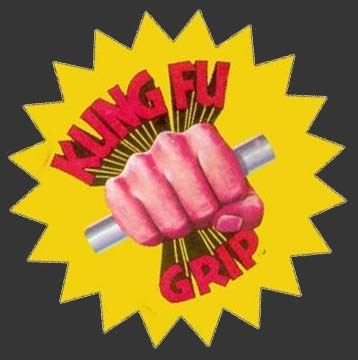

Yesterday I ordered my 2nd Captain of Crush Hand Gripper. Years ago I bought the #1, which requires 140 pounds of pressure to close. It took me a long time before I was able to close it end-to-end in both hands. Now, I am ready for the next [grip strength](/2009/10/weight-lifting-wisdom-for-the-tall-lanky-guy/) challenge. The #1.5 requires 167.5 pounds of grip strength to close.

I wonder how long it will take me to close the #1.5 end-to-end in both hands?

UPDATE (May 19, 2010): I was able to close the #1.5 end-to-end in both hands on my first attempt. Now I am wondering if I should buy the #2 (195 pounds) or #2.5 (237 pounds).

---

## Comments

### thomas
*May 16 at 2010 at 6:47 AM*

I did a brief search on gripping.  couldn't find anything other than bodybuilding stuff.  What is the benefit of this other than the obvious? (less likely to drop groceries).  

thanks, t

---

### MAS
*May 16 at 2010 at 2:42 PM*

Mostly weight lifting, see my <a href="https://criticalmas.org/2009/10/weight-lifting-wisdom-for-the-tall-lanky-guy/" rel="nofollow">other post</a> on the topic.  

The weights don't need to be in the gym.  Rock climbers use grip strength, so do cops when they detain suspects.  Yesterday I fired a Glock 45 for the first time.  The kick didn't phase me at all.  

I have discovered that improving my grip strength helps me lift larger weights more safely.

---

### t.bone
*May 17 at 2010 at 4:51 AM*

Thanks.  I have noticed for years that my wrist/palm area are the weakest part of my arm and also the point of friction obviously that experiences stress.  Seems like a good idea, another benefit may be when you fall down, usually unconsciously stick out your hands.

---

### t.bone
*May 17 at 2010 at 4:51 AM*

thanks.  Also when you fall down, your hand/wrist area absorb the stress.

---

### Nick
*May 25 at 2010 at 5:12 PM*

I totally forgot about these.  I'm going to order the #1 today.

---

