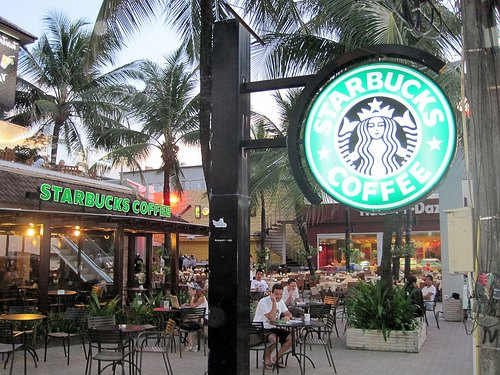
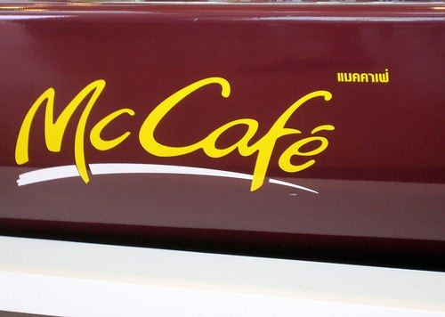
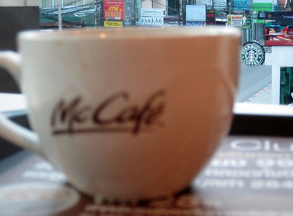

Just because I am on vacation doesn't mean that I don't still wake up early and seek out coffee. Apparently, I must be the only one that visits Phuket, Thailand and still desires and espresso at 7 AM. I can wait until 8 AM, but 9 AM? Are they mad? I saw one Starbucks that didn't open until 10 AM.  _Starbucks - Phuket, Thailand_  _Starbucks - 9 AM Opening in Thailand_ I am so fortunate to live in America, where the baristas wake up before me. But I am in Thailand and I still need coffee. What was I to do? A dark thought entered my head and I knew exactly what I had to do. Just like when I visited Montevideo, Uruguay in 2006, I knew there was only one place to get coffee this early. Yes, I went to McDonald's.  _McCafe Espresso Machine in Thailand_ It was just 2 weeks earlier that I was sipping an _Ethiopian Harrar Makeda Longberry Single Origin Espresso_ from Victrola Coffee in Seattle. Now I was entering _McCafe_. Ah, the sins of Thailand. In my defense, I had no option. Bangkok had options, Patong Beach had _McDonald's_. I turned out to be the only customer they had in the 7 AM hour. Having been burned by so many awful espressos since arriving in Thailand, I ordered an Americano or as this _McCafe_ calls it, the Long Black. Maybe it was my super low expectations or the fact _McDonald's_ was the only one that was able to lift my tired haze, but I found the quality to be OK. Unlike _Starbucks_, which has worse quality overseas, I found the _McCafe_ in both Uruguay and Thailand to be superior to the quality of the _McCafe_ in Seattle (Ballard).  _McCafe in Thailand - What is in the background? Answer below._ Thailand is cheap when it comes to food and lodging. It is not cheap when it comes to coffee. In fact, an Americano (aka Long Black) at the _McCafe_ in Phuket was about $3 USD. Over the course of 3 mornings, I spent more money on McCafe coffee than I did food the rest of the day. The shame!  _McCafe with a Starbucks in the background_