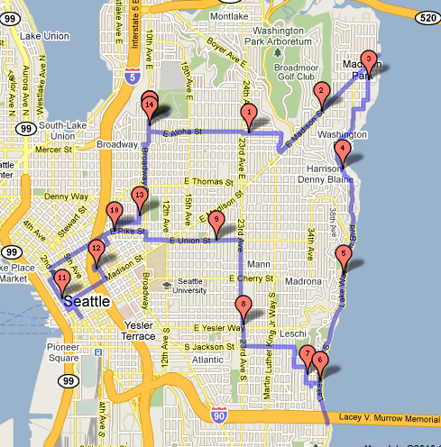

Since moving to Northgate it has been a while since I've done a Seattle urban hike greater than 10 miles. Today I tackled one of my new favorite areas, which is the Seattle side of Lake Washington between the two bridges. Along the way I checked off two more places on my [Seattle Disloyalty Card](/2010/05/seattles-disloyalty-card/). Total distance covered: [14.05 miles](http://www.gmap-pedometer.com/?r=3753815). 