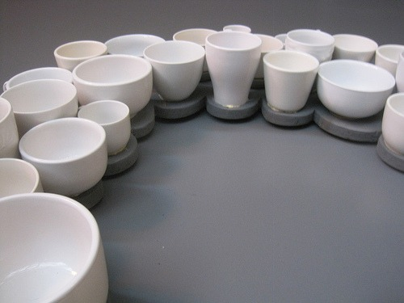

Today I completed my first _Disloyalty Card_. The [Disloyalty Card](/2010/05/seattles-disloyalty-card/) lists 10 independent coffee shops in the Seattle area. Before I announce my favorite three, I will say that I didn't have a single bad espresso.

1.  **Urban Coffee Lounge** - The single origin espresso with the Indonesia Gajah Aceh was stellar. I liked it so much, I drove to Stumptown and bought 12 oz for my home espresso machine. Get out to Kirkland. It is worth the trip. Just watch out for the speed traps.
2.  **Makeda Coffee** - I love the Hula blend by Seven Roasters.
3.  **Tougo Coffee** - A perfectly pulled espresso using Stumptown's Hair Bender blend.

Time to start Round #2.

_Urban Coffee Lounge - Cups on the Wall_

Have you completed your Disloyalty Card yet? What were your favorites?

---

## Comments

### que
*June 2 at 2010 at 2:01 AM*

I haven't completed my first card, but have already started a second one!
As you said they are all good. My preferences according to my personal taste of the espressos:
1. Urban Coffee Lounge (in both visits, in fact I'm amazed every time I go there)
2. Neptune
3. Fonte (Ethiopia Nekeissi)
4. Trabant
5. Equal Exchange
7. Aster

---

### MAS
*June 2 at 2010 at 2:13 AM*

I too had the Ethiopia Nekeissi at Fonte.  Much better than their standard blend.  I would have scored Neptune higher if I had their new blend.  Instead I gambled on their SO Brazil.  Not as good.  Sometimes the SO Espresso gamble pays off, sometimes it doesn't.

---

