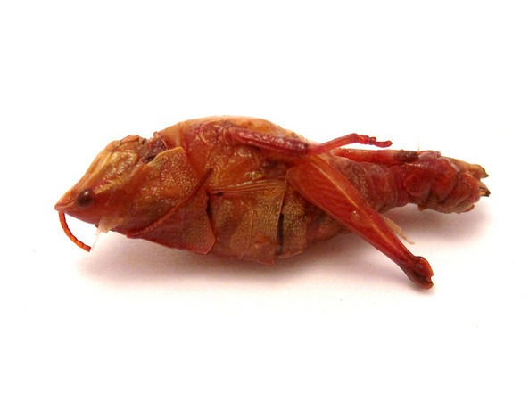

I had the pleasure of eating some crickets on Sunday. They were prepared and cooked in style used in Oaxaca, Mexico. Not sure what spices were used, but they were delicious. I could eat a full bag easily. Better than popcorn!

---

## Comments

### Nick
*June 23 at 2010 at 7:31 PM*

You are a better man than I am.  I don't think I could even try a single one.  Not even drunk in Thailand like Vladimir did with those ants.  :-)

---

### MAS
*June 25 at 2010 at 6:12 PM*

@Nick - if you didn't see this food and just started eating, you would like it. Damn tasty!

---

### Dave
*August 16 at 2010 at 4:34 PM*

Food tastes good when you're hungry.

---

