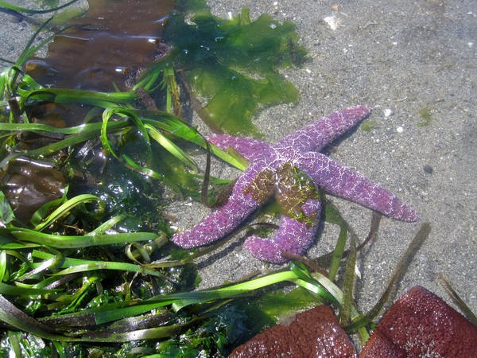
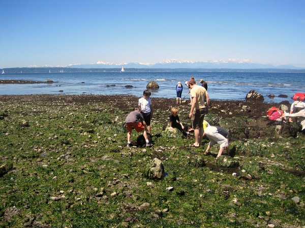

This weekend the tide was at lowest level for the summer. It was so low, you could walk from Golden Gardens to Carkeep Park on ground that is normally covered with water. Below are some photos from the hike.     [Photo Gallery for Low Tide Ballard (2010)](https://www.flickr.com/photos/129592470@N02/sets/72157649709149969/)

---

## Comments

### Joe
*June 14 at 2010 at 7:54 PM*

That golf ball creature is impressive!

But seriously... lovely shots!

---

### Nick
*June 15 at 2010 at 5:35 PM*

Too cool!  I love starfish.  I have never understood their evolutionary purpose, but they are just so darn cool looking!

---

