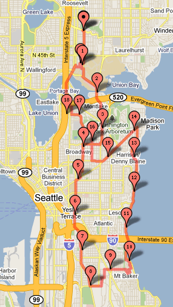

Last week I did an Urban Hike [between](/2010/05/urban-hike-between-the-bridges-edition/) the 520 and 99. Today I went a [little further]( http://www.gmap-pedometer.com/?r=3775340).

---

## Comments

### Ed
*June 2 at 2010 at 4:37 AM*

Looks like a fairly long hike. Were there ocassional Grok type sprints?

---

### MAS
*June 2 at 2010 at 3:20 PM*

I wish.  Sprinting still triggers back pain for me.  Someday.

---

