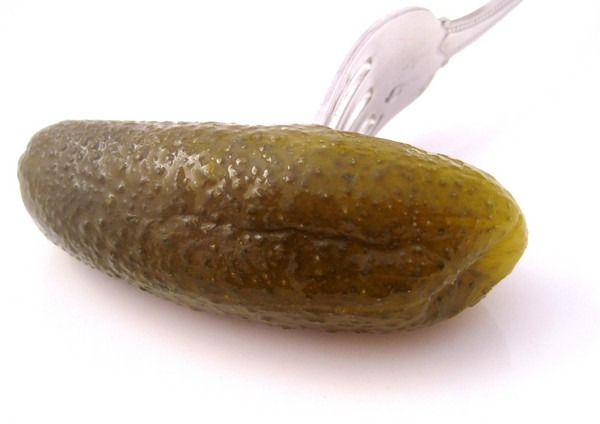

Last year I made pickles for the first time. The problem was it wasn't a true Lacto-fermentation. All I did was dump pickling cucumbers into old pickle juice. Bathing cucumbers in pickling juice is not the same as making pickles. What I took pride in doing last year now seems embarrassing. Well, two weeks ago I did it correctly. Dill, garlic, sea salt, and patience. The result was much better tasting. Some of the best pickles I have ever had.  If you are interested in learning more about making fermented foods, I recommend the book _Wild Fermentation_. This book also has the foundation I started with when I began making kimchi.  _Wild Fermentation: The Flavor, Nutrition, and Craft of Live-Culture Foods by Sandor Ellix Katz_

---

## Comments

### dhammy
*July 29 at 2010 at 2:01 PM*

I put this one in my queue at the library a couple of weeks ago.  I've already been into the probiotic foods lately and have been making my own Kombucha and Kefir.  Most of the family enjoy the Kombucha although I'm the only one that partakes in the Kefir.  I'm planning to make some Kimchi and/or Sauerkraut at some point.

---

### MAS
*July 29 at 2010 at 3:25 PM*

Sweet.  I love Kombucha.  Sauerkraut is a lot more work than Kimchi and less flavor IMO.  I still haven't done yogurt or kefir.  That is next.

---

### Nick
*August 3 at 2010 at 5:46 PM*

Nice!  I really want to start making my own yogurt.  Check your Amazon account.  Should be a few pennies coming your way shortly.  :-)

---

### MAS
*August 3 at 2010 at 7:07 PM*

@Nick - thank you!  I need all the pennies I can get.

---

