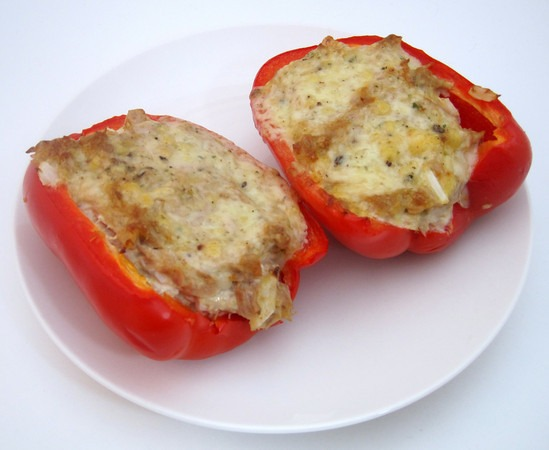

Who needs bread? Not me. I created a primal tuna melt using a carved out red bell pepper. Topped it off with some cheese and then put in under the broiler for a few minutes. Very tasty. I'll be making this again.

#### Ingredients

-   Tuna
-   Red Bell Pepper (or Yellow, Orange or Green)
-   Cheese

#### Instructions

1.  Make Tuna
2.  Carve out Red Bell Pepper.
3.  Place Tuna inside Red Bell Pepper
4.  Top with sliced Cheese
5.  Broil until done.

UPDATE (July 28, 2010): Because the cheese melts so fast, I have found heating the pepper for a few minutes prior to Step 2 improves the flavor.

Prep Time: 5 min Cooking Time: 10 min

---

## Comments

### Ed
*July 5 at 2010 at 3:34 PM*

That's a great idea, looks good.... i'll give it a shot.

---

### Nick
*July 6 at 2010 at 5:04 PM*

Sadly, I still need bread.  I've taken to only eating sourdough now, but I still love a good sandwich, and there is no real substitute for some nice toasted bread.  :-)

---

### MAS
*July 6 at 2010 at 5:10 PM*

@Nick - The substitute for bread is increased nutrient absorption.  I'd love to see you go 30 days with no gluten.  No bread, pasta or beer.  Nothing.  Drink wine and find a gluten free bread option, if you must.  At the end of 30 days, reintroduce it to your diet and see what happens.  When I did this I discovered just how bad it was.

---

### Nick
*July 6 at 2010 at 5:14 PM*

I'll seriously consider giving that a shot.  Beer would be easy to cut for a month, and I don't eat pasta anymore, so really I just need to cut out bread.  But I bet that would be a lot harder than it sounds, since it rules out burgers and sandwiches.  But I may give it a try sometime soon.  I guess I'm still not convinced on the gluten front, but that test would do it one way or the other.

---

### MAS
*July 6 at 2010 at 5:28 PM*

There are gluten free breads now and when you are away, you could just go the salad route.  It's old habit for me now.  I NEVER thought I could give up bread, now it easy.  

Anything you can do to increase nutrient absorption will help you lean out.  Fermented foods are great, as are foods high in inulin.  Cutting the carbs helps control insulin, increasing nutrient absorption will help with leptin.

---

### Nick
*July 6 at 2010 at 5:36 PM*

Ok, I'll give it a shot.  Headed to Trader Joe's after work to find some gluten free bread.  :-)

---

### Ed
*July 7 at 2010 at 4:36 PM*

I had the MAS primal tuna melt for lunch yesterday. Dam good too. I put a little low carb Trader Joes Hot chili Sauce on it too. Yummy.

---

### MAS
*July 7 at 2010 at 8:18 PM*

@ed - Sweet.  I made it again yesterday myself.  It is a new staple food for me.

---

### Malene
*August 26 at 2011 at 10:27 AM*

Hi :)

Is it possible to make bread with glutenfree flour?? Or is that just as bad?

---

### MAS
*August 26 at 2011 at 2:42 PM*

@Malene - Yes it is. I personally don't consume gluten-free bread, but it should be better than regular bread. For me - removing bread completely - has worked extremely well.

---

### Krista
*March 6 at 2013 at 8:13 PM*

I just made this for lunch and its very tasty and filling! Thank you!

---

