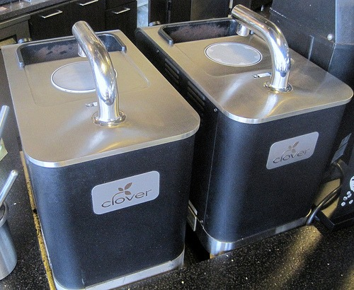

Not only does Seattle have some of the best roasters, cafes, and baristas in the world, but we also have some of the best equipment. Seattle is the home to three unique coffee brewing systems that most of the country does not have. If you live in Seattle or came here on a coffee vacation, here are 3 coffee brewers you need to try.

## The Clover

Before Starbucks acquired the Clover, several independents carried this $11,000 single-cup coffee brewer. After Starbucks took over, many of these coffee shops got rid of their Clovers. Starbucks now has the technology to make an excellent cup of coffee, but they don't because their roast profile is too fast. The Clover still needs great coffee to excel. Fortunately, Seattle still has three remaining Clover machines in the hands of independent coffee shops. If you want an excellent cup of Clover Coffee, avoid Starbucks. Visit Aster or Trabant. 

1.  Aster Coffee Lounge (BALLARD) 5615 24th Ave NW (now Toast Ballard)
2.  Trabant Coffee (UNIVERSITY) 1309 NE 45th Street
3.  Trabant Coffee (PIONEER SQUARE) 602 2nd Ave

## The Slayer Espresso Machine

Seattle is home to a next-generation espresso machine called the Slayer. I've had it a few times and although not every shot has been perfect, the flavors it pulls out of espresso have been amazing. _Gizmodo_ describes what makes the Slayer special:

> ...it allows a barista to easily play with pressure to do some interesting things like start with a low pressure extraction, ramp up to full pressure, then back it down to get different textures or flavors...

 _Photo [Slayer](http://www.flickr.com/photos/macchiato1/3972796861/) by Lay-Luh_ You can try a Slayer Espresso in two places.

1.  Equal Exchange Espresso (BALLARD) - 1400 NW 56th St - Ballard Market
2.  Vovito Caffe & Gelato (BELLEVUE) - 700 11th Ave NE - The Bravern

Zoka Coffee had one in Kirkland that was removed. It may or may not surface at one of their Seattle locations.

## The Trifecta

The Trifecta is the next generation of the single-cup brewer. It is like a Clover with [more controls](http://www.flickr.com/photos/digitalcolony/4619029274/). Some coffees do OK in the Trifecta and some shine. Seattle Coffee Works is home to the only Trifecta in Seattle. If you order one, I encourage you to ask for their recommendation on which coffee to use. They are always tinkering with this machine and will certainly have a solid recommendation. 

1.  Seattle Coffee Works (DOWNTOWN) - 107 Pike St

_Sources:_ A Little $18,000 Espresso Machine Called Slayer - Gizmodo article (JULY 2024: article offline) [Zoka Kirkland](http://popbites.tumblr.com/post/945230256/zoka-kirkland) - PopBites post on the Slayer status with Zoka. **UPDATE March 2014:** I thought I'd provide a few updates to this post since a few years have passed.

1.  Aster Coffee Lounge has been renamed, Toast Ballard. They still have the Clover.
2.  Seattle Coffee Works got rid of their Trifecta. Tony's Coffee has a mini cafe in East Ballard that has one. I've had this a few times since the original post, which hasn't impressed me. So I wouldn't say you _need_ to try this.

**UPDATE April 2015:** Tony's closed their East Ballard cafe. **UPDATE May 2019:** Seattle's last Clover coffee machine for indie coffee is dead. Now only Starbucks has them.