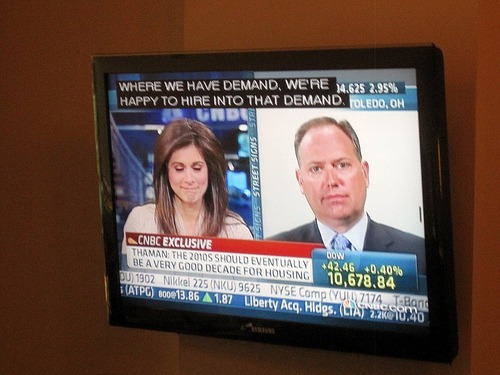

When I first moved to the Seattle area in 2007, I started out in Bellevue. Every weekend I would drive into Seattle and explore the coffee scene. It was like two different coffee worlds. Somehow those bridges were keeping all the quality coffee places trapped on the Seattle side. That is all changing now.  In the past year, we have seen good coffee establish a foothold in Kirkland with Urban Coffee Lounge and Zoka. Now good coffee has arrived in Bellevue. _Vovito Caffe and Gelato_ is now open in the Bravern Shopping Center. Vovito sports two Slayer espresso machines and their own espresso blend, which includes Indian Monsoon Malabar. I'm a fan.  _This is the first coffee shop I have seen that plays CNBC. You're not in Capitol Hill anymore!_ When the _Coffee Club of Seattle_ visited last week, we met the owners and the head barista, Alex. Alex was formerly of _Trabant Coffee_ and runs the local coffee website _Why Not? Coffee_. He served us signature drinks, that combined espresso, whipped cream, coconut, and orange peel. Bellevue now has a quality coffee option with Vovito. Next time I go, I plan to try the gelato. :) _Sources:_ VoVito Caffe & Gelato - 700 110th Avenue NE, Suite 195 Bellevue, WA 98004 Why Not? Coffee - Seattle's Coffee Culture and more. Coffee Club of Seattle - Aug 4, 2010 event.

---

## Comments

### Marian
*August 9 at 2010 at 8:05 PM*

I was puzzled about the CNBC too.  Maybe the Microsoft connection, upstairs?  Then why not MSNBC?

---

### MAS
*August 9 at 2010 at 8:08 PM*

@Marian - good point.  Maybe CNBC is just on during trading hours?  I doubt they would keep it on during the weekends.

---

### Brendon
*August 9 at 2010 at 11:27 PM*

Is that where Alex went? I hadn't seen him that last few times I was by the U District Trabant...

---

