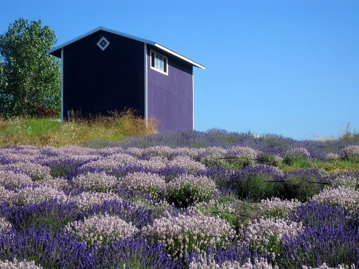

In the past two weeks I have heard the disappointed voices of a few friends that were doing so well on their diets until summer came. Then all their progress stalled. I'm here to offer some encouragement. Summer is not the season to lean out. Winter is. Let me explain.

Long days tell the brain that it is summer. Summer is the season where carbohydrates are most plentiful. Our evolutionary design is similar to other mammals. For survival purposes we gain fat before winter comes, because once winter arrives there will be less daylight and fewer sources of carbohydrates.

_Summertime in Sequim, WA_

The book [Lights Out: Sleep, Sugar and Survival](/2010/05/lights-out-sleep-sugar-and-survival/) helped me understand the role seasons play on the hormones and how that effects the body. Because winter brings the possibility of famine, **during the summer we all have an _instinctive carbohydrate craving to store fat for hibernation and scarcity_**.

Modern vanity is the exact opposite of our evolutionary past. We allow ourselves to get fat from holiday parties, comforted in the fact that we can hide our winter weight underneath coats and sweaters. Then at the first sign of spring, the modern man decides it is time to get lean. Only at this point, the brain gets the signal that the days are longer and it is time to eat more carbohydrates. And every year we get a little bit heavier.

Since we now have an endless supply of food and there really isn't a need to fatten up before winter, what should we do? My solution this summer has been to double my weight lifting, eat the occasional ice cream and take a break from intermittent fasting. In other words, I am not fighting it. I will use the growth signal and direct it towards muscle gain.

If you were successful dieting this summer - congrats. If not, don't fret it. Your body was designed to gain fat during the summer. The time to get lean is approaching.

---

## Comments

### Nick
*August 31 at 2010 at 7:00 PM*

Yep, that's pretty much exactly where I'm at.  I've lost a couple of more pounds, but it's been a pretty serious slog.  I remember that my successful start last year was around October, so I'm hoping to get going again in the next few weeks.

Plus, being sick for 4 weeks didn't help one damn bit!  :-)

---

### MAS
*August 31 at 2010 at 9:59 PM*

The shorter days of summer mean less melatonin is released at night.  Melatonin is a powerful anti-oxidant and plays a role in white blood cell immune function.  Since I doubt you've been going to sleep at 10 PM in a purely dark room with no blue light electronics, a compromised immune system during the summer makes sense.  

Good luck this fall.  Hibernate yourself thin!

---

### Mike
*September 1 at 2010 at 3:03 AM*

Re summer not for leaning out....
I have found the exact opposite personally.
When it's warm, my appetitie is substantially lower than during cold winters when my cravings for carbos seem to be at their highest.  Doesn't help of course to have Thanksgiving and the end of year holidays in there too.

---

### MAS
*September 1 at 2010 at 4:00 PM*

@Mike - I noticed that my appetite only increased this summer when I cut back on the coffee.  However, I decided to eat more knowing that come winter I'll be in and out of ketosis.  

Thanksgiving is fine as long as you eat veggies and turkey.  And then stop.  :)

---

