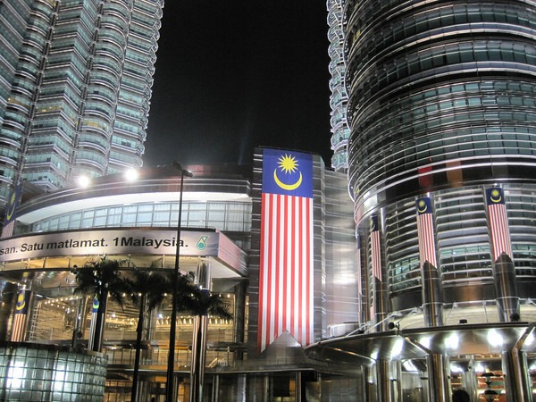

A new study out of the University of Haifa shows the negative health effects from night time exposure to artificial light. From [Light at Night and Cancer](https://www.sciencedaily.com/releases/2010/09/100902101625.htm):

> The researchers hypothesis was that LAN harms production of melatonin, a hormone that is released from the pineal gland during the dark part of the 24h cycle and which is linked to the bodys cyclical night-day activity and seasonality. When this hormone is suppressed, the occurrence of cancer rises.

Cancers mentioned include breast and prostate. The study put mice into 4 groups.

1.  "Long Days" - 16 hours of light / 8 hours of darkness.
2.  "Long Days" with Melatonin - same as #1 with melatonin
3.  "Short Days" - 8 hours of light / 16 hours of darkness
4.  "Short Days" with 30 minute light interruption

The results showed that those in the Long Days group had the most cancerous growth and those in the Short Days group had the least. Mice that were treated with melatonin had a lower death rate and tumor size that those that weren't. One researcher stated:

> Exposure to LAN \[light at night\]- disrupts our biological clock and affects the cyclical rhythm that has developed over hundreds of millions of evolutionary years that were devoid of LAN....

This study came as no surprise to me. Back in May, I reviewed the book [Lights Out: Sleep, Sugar and Survival](/2010/05/lights-out-sleep-sugar-and-survival/). It went into great detail the damage that artificial light causes to our health. Sleep is the daily repair cycle. When you shorten that cycle or disrupt it by sending a false signal (sleeping under lights), the body gets behind and growth gets the upper hand. Growth includes viral infections and as this study shows, cancer. From _Lights Out_:

> Going to sleep with the sunset means a whole-body melatonin bath, and a sharp increase in prolactin. Prolactin enhances the production of T cells and NK (natural killer) cells. These are the first lines of cancer defense.

My advice is to make your sleeping environment as dark as possible with as few electronic devices as possible and go to bed earlier. If you have a choice between waking up an hour early to run on a treadmill under florescent lights or sleeping more; choose sleep. I have some more tips in the post [Turning Down the Lights](/2010/07/turning-down-the-lights/).

_Photo taken during my December 2009 trip to [Kuala Lumpur, Malaysia](/2009/12/arrived-in-kuala-lumpur-malaysia/)_

---

## Comments

### Chris
*September 7 at 2010 at 6:38 AM*

Interesting stuff Michael.  I've now installed flux on my Mac after reading your posts.  I've had quite a bit on sleep on my blog over the years:

http://conditioningresearch.blogspot.jp/search/label/sleep

I found your blog the other day - I was searching for posts/reviews of the book Shallows which I am reading at the moment.  It was interesting to find so many issues here that are areas in which I am also interested - paleo diet for example. Good stuff.

Cheers

Chris

---

### MAS
*September 7 at 2010 at 3:08 PM*

@Chris - I've been reading your site for a while.  Great stuff.  I really appreciate the video interview with Dr. Sarno you posted a while back.

---

