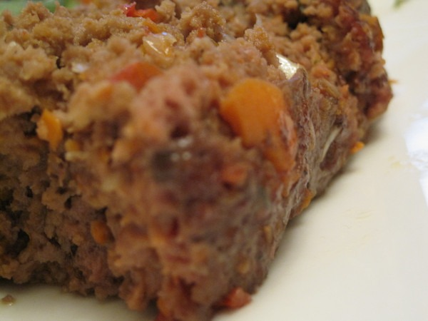
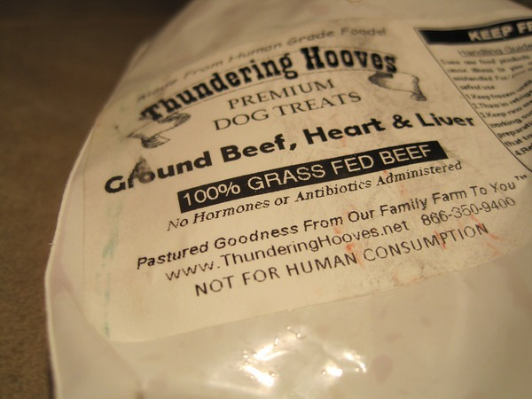

I buy the majority of my meat from Thundering Hooves. This is a pasture farm in the Walla Walla Valley of Washington that sells beef, lamb, pork and chicken. One of the items they sell is for pets. It is _1 lb of Beef and Organ Meets for Pets_. The description reads:

> A nice blend of 85% ground beef, 10% ground heart, and 5% ground liver is a fantastic source of protein to add to your pet's diet - all made from Thundering Hooves 100% grass fed beef. This is one pet food your dog or cat is going to love! (Comes in 1 lb. pkgs. - Reg. $3.50/lb.)

My roommates and I have figured out that - despite what the label says - is it perfectly fine for human consumption. Organ meats are extremely healthy when the animal is pasture raised. And you can't beat the price. The one thing we have learned is that it doesn't taste good as burgers. Chili or meatloaf is ideal. No medium rare. It tastes best at medium well.

Below is my _Pet Food Meatloaf_ recipe that was a huge hit recently.

**Summary**: _Using pastured "pet food" ground beef to make meatloaf._

#### Ingredients

-   1 lb ground beef
-   1 lb ground beef w/15% organ meat ("pet food")
-   3 cloves garlic
-   1 onion
-   1 carrot
-   1 tablespoon chili powder
-   1 teaspoon sea salt
-   1 teaspoon thyme
-   1 egg
-   1/2 teaspoon black pepper
-   coconut flour (optional)

#### Instructions

1.  Preheat oven to 340 degrees
2.  In a food processor blend onion, pepper, carrot and garlic.
3.  Combine beef, spices and veggies into bowl and mix by hand.
4.  Place mixture into an oven safe pan.
5.  Cook for about 35-40 minutes.
6.  Test with meat thermometer until center is 155-160 degrees.

#### Quick Notes

This is a very fatty meatloaf. You can pour off some of the liquid if you like. Also using a coconut flour will add some thickness.

#### Variations

The "pet food" is of course optional. Feel free to use regular ground beef for the entire meatloaf if you like.

Cooking time (duration): 60 (15 min prep, 45 min cooking) Number of servings (yield): 6

---

## Comments

### TigerAl
*September 9 at 2010 at 10:58 PM*

I'm assuming that you asked Thundering Hooves why their label says "Not for Human Consumption"?  If so, what did they say?

---

### MAS
*September 10 at 2010 at 3:29 AM*

I didn't ask.  I do know some people that claimed to have talked to Thundering Hooves about it and got unofficial approval.  Not sure exactly.  I've had it several times.  No problems so far.  And my coat has never been this shiny. ;)

---

### Stuart
*September 10 at 2010 at 3:58 PM*

I've been waiting for the post that signals you've gone off the deep end. I think this is that post. :)

---

### TigerAl
*September 12 at 2010 at 2:23 AM*

Dude, I'm with you on the Thai "stick food" but "not for human consumption" labeled food?  That's a little scary..

---

