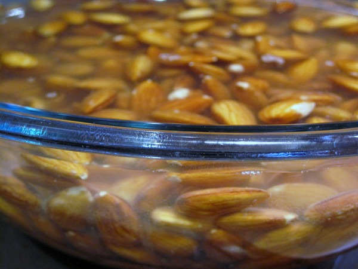
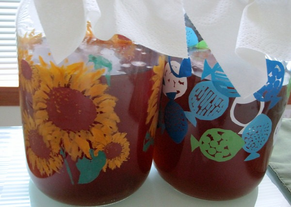
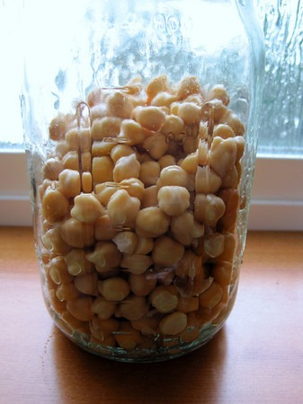
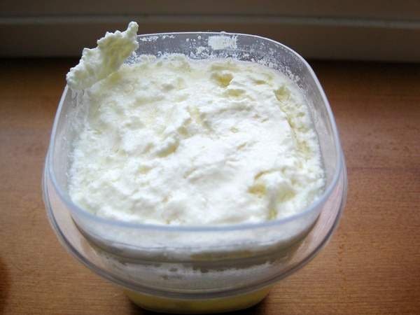

This morning I looked around my kitchen and saw just how far down the path of nourishing food I've gone. _Nourishing_ is a term I borrowed from the Sally Fallon book Nourishing Traditions. It is a cookbook that teaches you how to prepare food in the manner that cultures did prior to _modern times_. Our ancestors knew how to prepare meals in a healthy manner without microwaves or even refrigeration. It is time we relearned that knowledge. Let me take you on a mini-tour of my kitchen to explain what I mean. **Soaking and Drying Almonds** Almonds and other nuts have anti-nutrient properties called enzyme inhibitors that can be tough on your digestive system. By soaking nuts overnight in water with a little sea salt, you can neutralize those enzyme inhibitors. This action leads to an increase in vitamin absorption.   _The almonds are drying in a food dehydrator and will be ready tomorrow morning. That is when I'll be doing pecans!_ **Kombucha - Continuous Brewer** Kombucha is a fermented tea with a trace amount of alcohol. Besides being a refreshing beverage it is believed to have health benefits including probiotics.   _Can you see the SCOBY (Symbiotic Culture of Bacteria and Yeast)?_ **Kimchi** I've been making [kimchi](/2010/04/bok-choy-kimchi-recipe/) for months. I love it. I'm currently on the last day of my latest fermentation. I ran out of Korean dried chili flakes, so I tried some Thai chili peppers in this one.  **Sprouting Garbanzo Beans** Beans are loaded with anti-nutrients. Too much for this post, but the way to prepare beans is to get the beans to lower their plant defenses so the nutrients can be absorbed. Primitive cultures have figured out that soaking and sprouting beans accomplish this. I am going to make some hummus tomorrow. I expect these garbanzo beans will be sprouting by then.  _(UPDATE 9/4/2010) Warning: kidney and soybeans are toxic when sprouted._ **Waking Up My Kefir Grains** Frequent commenter _DHammy_ recently sent me some kefir grains. My first batch was a little thin. My second batch was better. Later today I will start batch number 3. The third time is a charm, right? Kefir is a fermented milk drink that is loaded with many strains of healthy bacteria. I've heard of people who have had amazing health benefits after adding kefir to their diet. Kefir is the extreme version of yogurt.  **Why?** Our food is too dead and too processed. Learning how to prepare foods in a traditional manner and how to restore positive gut flora will help your health. Two books that will help you on this journey are Nourishing Traditions and Wild Fermentation.

---

## Comments

### dhammy
*September 2 at 2010 at 5:25 PM*

Great photos, MAS!  Your kefir looks pretty thick to me!

---

### MAS
*September 2 at 2010 at 5:29 PM*

@Dhammy - That was just the grains with a splash of "wake up" milk.  The 3rd kefir batch will start tonight!

---

### TigerAl
*September 3 at 2010 at 9:41 PM*

Since you mentioned kimchi, I'm connecting through Seoul on a trip in October so decided to spend a couple of days there... looking forward to some authentic kimchi and a Korean food/cultural adventure :)

---

### MAS
*September 5 at 2010 at 2:12 AM*

@TigerAl - Nice.  Where else are you heading?

All - I just added a warning to the post about not sprouting kidney or soy beans.

---

### TigerAl
*September 5 at 2010 at 3:52 PM*

Just a couple of days in Seoul before heading to India on Korean Air.. don't remember whether you made it there on your trip last year so if so, recommendations would be appreciated :)

BTW, I love the gluten free diet and I'm feeling really good after a week of doing it.  Not sure I can make it a lifestyle when the 45 days are up (I extended by a couple of weeks) because I love bread/pasta but cutting back to once a week should be good too, I think.

Thanks for the kidney/soy beans tip, did not know that.

---

### MAS
*September 5 at 2010 at 4:00 PM*

@TigerAl - I did spend a day in Seoul.  I was seeking out great coffee - which I did not find.  However, I did find some great tea there. 

There are methods to make grains better for you.  This <a href="https://www.passionatehomemaking.com/2008/04/whole-grains-grinding-soaking.html" rel="nofollow">post</a> details how and why you should soak grains.  Right now I am eating steel cut oats that I soaked last night using a whey fermentation.

---

### Greg
*November 30 at 2010 at 3:45 AM*

Good stuff!  Do you know how to soak rice/oatmeal/quinoa?  I'm experimenting with adding small amounts of rice, oatmeal, and quinoa into an otherwise primal/paleo diet.

---

### MAS
*November 30 at 2010 at 4:17 AM*

@Greg - Here is how I do steel cut oatmeal.  

1 cup oats
1.5 warm filtered water
4 tablespoons of whey or vinegar
(mix overnight)
boil 1.5 filtered water + 0.5 teaspoon sea salt
add mixture (no draining)
cook for 10 minutes (low heat, keep stirring)

Steel cut oatmeal is far less likely to have traces of gluten than regular oatmeal.  

I've never soaked rice or quinoa. My guess is that it would be done in the same manner, but I am not certain. The book that covers this best is Nourishing Traditions.  It is a cook book with a lot of informative side bars on traditional culture cooking (Weston A Price stuff).

---

### Greg
*December 2 at 2010 at 4:49 PM*

Thanks!  I tested this out this morning.  Should you still be able to taste the vinegar?

---

### MAS
*December 2 at 2010 at 4:57 PM*

@Greg - Unfortunately you can.  I prefer to use whey.  I also add almond butter to the oatmeal and dash of cinammon.

---

