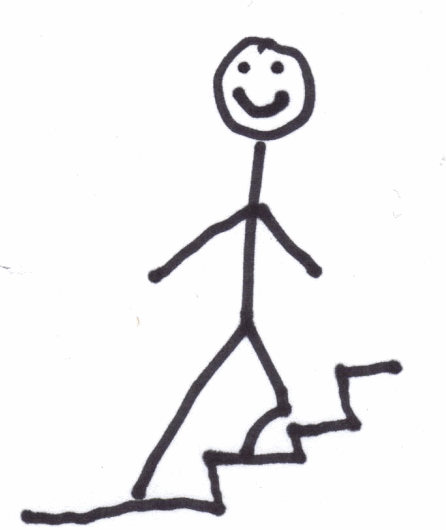
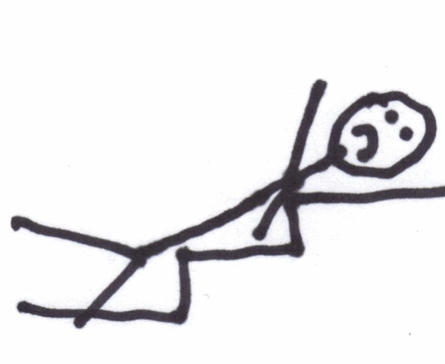

If you are wondering how I have been able to read so many books in the past month, it is because I injured myself three weeks ago. Laying on a heating pad recovering is perfect for reading. When coming down from the stairs, my brand new sock hit the slick wooden floor and I went airborne crashing down into the stairs. I hit my head and my left lower back. My head was fine. My back wasn't. Below is an artist rendering.    Even though I am feeling much better, I am still in some pain. Driving (left turns) and getting out of the car is where I feel the most pain. Thankfully, I have recovered enough that I can do pull-ups, push-ups and even walk for miles.

---

## Comments

### dhammy
*September 21 at 2010 at 5:31 PM*

Sorry to hear about your tumble.  Get better!

The artistic rendering was riveting and disturbing.  It felt so real that my own back started to hurt!

---

### Ryan
*September 21 at 2010 at 11:29 PM*

I am making a mental note here: New socks + wooden floor = risky.

---

### thomas
*September 22 at 2010 at 1:56 AM*

Get well soon!

---

### TigerAl
*September 22 at 2010 at 10:45 PM*

Note for MAS on new apartment: No stairs! :)

---

### MAS
*September 22 at 2010 at 10:52 PM*

<a href="http://www.youtube.com/watch?v=o3IQTjOMewg" rel="nofollow">I've fallen and I can't get up!</a>

---

### Ed
*September 30 at 2010 at 3:37 PM*

The artist rendering wouldn't hold up in court, especially when combined with your description.  You said you hit your lower left back but the image clearly shows a blow to the left shoulder.  And the rendering does not show this mysterious "sock".  

Keep reading and walking, and feel better soon.  Now that the summer is over, it's time for my return to coffee meetups.

---

