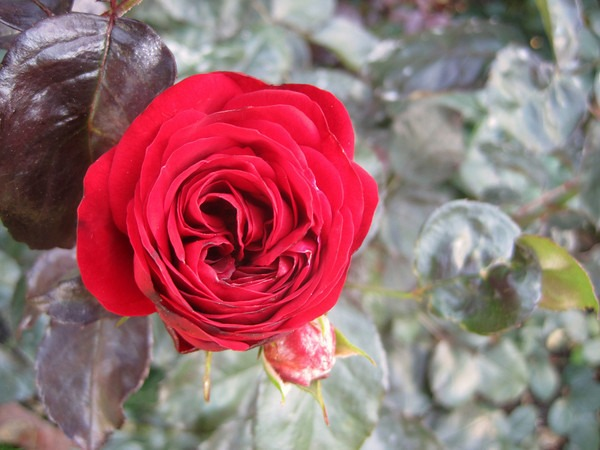
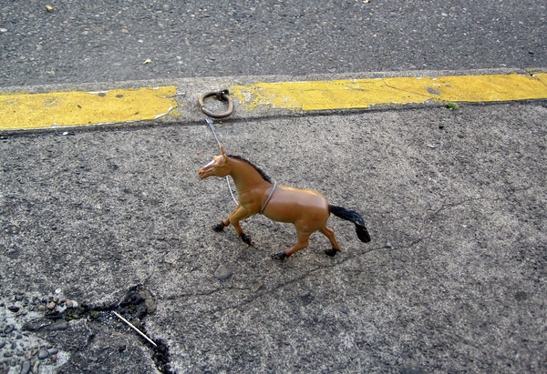

My only other visit to Portland, Oregon was when I drove from San Diego to Seattle in 2007. Since then the coffee scene has exploded down there. I will post a full report on [INeedCoffee](https://ineedcoffee.com) later. For now, I'll post a few non-coffee related photos.

_Khao Muu Daeng/Muu Krob from Pok Pok_

_Rose Test Garden_

_A toy horse hitched in the Pearl District of Portland._

_Basil Crispy Duck from Bangkok Bites (7915 SE Stark St)_

The Portland coffee photos are up [here](http://www.flickr.com/photos/digitalcolony/sets/72157625102483228/).