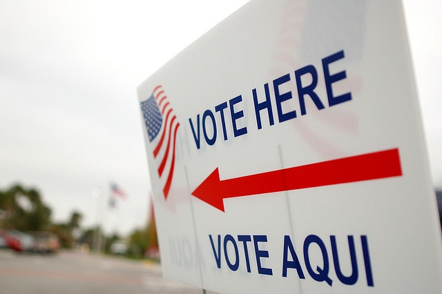

I never talk about politics on this blog. I consider myself post-political. One day I'll talk more about that. Not today though. Instead of complaining about the system, I'm here to offer my solutions. Today's episode is **The Voter**. We all know the problem. Voters are too dumb and are easily manipulated by negative ads. The problem as I see it is that many voters don't understand how our government works. If every voter understood how our government worked, we would be far less likely to fall for attack ads or irrelevant facts. We would nominate and vote for better candidates. And as a result, we would get a better government. My solution is that **in order to vote a citizen must pass the US Citizenship test**. We have to pass a driver's license test to drive on our roads. How about we spend an hour or two learning about how our government works before heading to the polling place? Understanding what it means to be a US Citizen shouldn't be just for immigrants. I think it should be for everyone that wants to participate in the voting process.  _[Photo](https://flic.kr/p/5zvkFt) by Erik (HASH) Hersman_ Participation rate in elections would fall, but the citizens that care enough to study and pass the test would see the power of their vote increase. The political debate would get more civil, as politicians would know that voters collectively understand government A LOT BETTER than they used to. If my solution were adopted we would see a mad rush by all political parties to educate the population on the Constitution and American history. Much better than the current scare tactics method. Wouldn't that be a great thing?

---

## Comments

### Paul
*October 27 at 2010 at 4:29 PM*

I like the idea of a voter test, only problem is you end up letting the politicos in charge make the test, not sure how that would play out. 

I'd like a test for candidates, basic constitutional knowledge and maybe a personality test too. hell f we won't let teachers teach in schools because they have a record why should people be allowed to govern with faults?

One huge thing i have always wished for is a questionnaire to be handed out to both (or all) candidates and have them, personally, fill out relevant questions and answer simple things in 1 paragraph or less. I often find myself starved for actual information on any of the candidates that hasn't been wrung through a PR person, a speech writer and an AR person. 

But that would be in a system that wasn't already fixed. Every-time i see a debate I'm reminded of the movie Dragnet with the Preacher and the Porn king having drinks, its like that but both parties want to be the preacher

---

### MAS
*October 27 at 2010 at 4:33 PM*

@Paul - That is why I like the Citizenship test.  I think it is non-political.  

We could go further.  Have scientists get together to create a basic science test.  Candidates could take the test and get certification if their score is high enough.  Do it across several disciplines.  

Why should credentials be limited to the private sector?  :)

---

### TigerAl
*October 28 at 2010 at 9:45 AM*

Slightly off topic but my vote is for reproduction certification: 
don't pass the test = you don't have the ability to bring another messed up human being into the world ... might solve a bunch of other issues as well :)

---

### MAS
*October 28 at 2010 at 2:54 PM*

@TigerAl - I would be opposed to Eugenics, as it would give the government even more power.  The future is probably going to be designer super babies.  Pick up your kit at Wal-Mart for $9.99.  :)

---

### Paul
*October 28 at 2010 at 3:12 PM*

I'm beta testing the higher end Kid-in-a-Kan right now, 2 beta's out the door. I think i'm out of invites though...

By the by when do we just install the lifecrystals in our hands and start weeding out the old and infirm? Nothing but a drain on the economy they are ;-)

---

