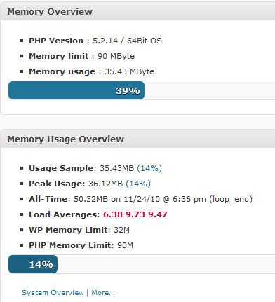

DreamHost promotes _unlimited_ domain web hosting for $8.95/month.  It seemed like a sweet deal, so I signed up for it.  The reality is that their offer is misleading.  DreamHost offers 100 MB of memory per account.  If you exceed this number – even for a second – they unleash a _procwatch_ to kill the process. At this point, you can reach out to DreamHost’s support team.  They will tell you that it is the fault of WordPress plugins and then try and upsell you on a VPS account.  They promise not to kill your processes if you get a VPS account.  Kind of like a shopkeeper that pays the gangster protection money so his store doesn’t burn down.  How sweet!  **My personal opinion is why should I pay for an enhanced service if the basic service is awful? I’ll just switch web hosts.** Back to the question of resources.  Just how much memory does a website running WordPress with some basic plugins use?  As of this writing, I have 2 WordPress sites on DreamHost.  I installed 2 plugins to help me track my memory usage: [WP-Memory-Usage](http://wordpress.org/extend/plugins/wp-memory-usage/) and [TPC! Memory Usage](http://wordpress.org/extend/plugins/tpc-memory-usage/).  Below is a screen shot from one of my sites.  The other site shows similar numbers.  With these two plugins I learned a few things:

1.  DreamHost limits your PHP memory to just 90 MB.
2.  A basic install of WordPress takes about 30 MB of memory on a 64 bit installation of PHP.
3.  I activated and deactivated every plugin.  Most used trivial amounts of memory.  No plugin exceeded 2 MB of memory.  Even the much aligned All-In-One SEO plugin used only 1.05 MB.
4.  Switching themes had almost no impact on memory usage.
5.  With as little as two domains using WordPress on DreamHost you are already reaching the upper limits of memory allocated. So much for unlimited domains.  Perhaps they should rephrase it to unlimited _unused_ domains?
6.  DreamHost has a serious LOAD AVERAGE problem.  The numbers in the above screen capture were the lowest I captures.  Often the Load Averages exceeded 10.

Even though I went looking for answers on memory usage, the load average numbers jumped out at me.  What do they mean and what is a good number? The article [Understanding Linux CPU Load – when should you be worried?](http://blog.scoutapp.com/articles/2009/07/31/understanding-load-averages) is a great tutorial on the topic.  It makes the case that the maximum load should not exceed the number of cores on the server.  My DreamHost server has 4 cores.   I monitored this number all day and it is always in the red zone. The CPU load on DreamHost servers is excessive. My advice is to stay away from DreamHost.  Their servers are overloaded and if you plan to host more than one WordPress account you’ll experience problems. UPDATE (Nov 25, 2010) – This morning the DreamHost Load times spiked much higher!

-   Load Averages: **144.95 45.93 21.12**

---

## Comments

### Srp
*July 26 at 2015 at 4:37 PM*

is there similar limit on other hosting networks like godaddy and blue host

---

### MAS
*July 27 at 2015 at 1:07 AM*

@Srp - Blue Host doesn't kill threads based on memory. The server will slow down under heavy load, which makes sense. I have no hosting experience with Go Daddy.

---

