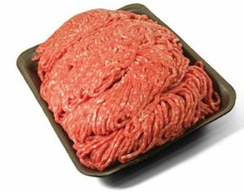
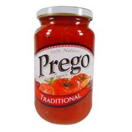
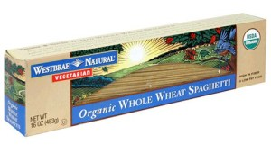
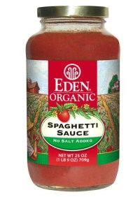

Over the years, I've gone from a standard American diet to a long fling with vegetarianism to a mostly paleolithic diet. This post is a visual guide to how I made spaghetti during each period.

### Childhood

Spaghetti was regular pasta, regular ground beef and regular pasta sauce.

### College

It was during this time there were a few _e.coli_ scares and the nation was just becoming aware of the health safety issues with factory farmed ground beef. It was then that I removed the ground beef from my spaghetti.

### Post College

Whole grains became the rage. I swapped out the regular spaghetti for whole wheat spaghetti.

### Rejecting Gluten

Once I became convinced of the dangers of gluten, I replaced the whole wheat pasta with [spaghetti squash](/2009/12/making-spaghetti-squash-the-1-page-zero-ad-tutorial/).

### Embracing Paleo

Once I was able to locate sources of quality grass pastured ground beef, I added that back into the spaghetti.

[photo](http://www.flickr.com/photos/ammichaels/5047413459/in/photostream/) by cheeseslave

### Eliminating Seed and Grain Oils

Turns out the innocent jars of spaghetti sauce aren't that innocent. Almost every brand on the shelf contains corn, canola or safflower oil. All are high in Omega-6 ratios and are implicated in several health problems. Many contain corn syrup. Now although I could make my own, there are jars of pasta sauce that use extra virgin olive oil and have no added sugar. The photo of the jar below is an example and not a specific endorsement.

### End of the Journey?

Today my spaghetti contains no gluten, no inflammatory oils and the meat is grass pastured. I'm happy with the flavor and it is easy enough to make. Will I continue to make changes? Probably, although no ideas come to mind at this time.

---

## Comments

### Ed
*November 27 at 2010 at 9:53 PM*

Like usual Im close behind you on certain dietary changes. But I make my own sauce and cook my own ground beef. Just incase I reconsider, where did you pick up the Eden organic at?

---

### MAS
*November 28 at 2010 at 12:48 AM*

@Ed - That was just an image I got from the Internet.  I don't recall what brand I had last.

---

### Ed
*November 28 at 2010 at 8:06 AM*

Okay, I will check out Trader Joes tomrrow when I go shopping.

---

### MAS
*November 28 at 2010 at 5:53 PM*

The last time I shopped for pasta sauce, I spent over 5 minutes reading labels.  I think I found two acceptable brands.  One was almost $8 and the other was $3.  Easy decision.  ;)

---

### Greg
*November 29 at 2010 at 5:31 PM*

Spaghetti squash is amazing!  For the most part, I've dropped the pasta sauce all together.  Plain canned tomato sauce and olive oil does work well in a pinch and is a good substitute for pasta sauces.

---

