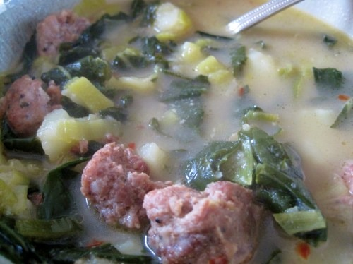

I received this recipe from a vendor at the farmers market. I used raw milk in place of cream and adjusted the ratio of ingredients. This soup was super delicious. Give it a try. If you don't have goat sausage, go ahead and use a _quality_ pork sausage. **Summary**: _A Toscana soup recipe using a spicy goat sausage._ 

#### Ingredients

-   1 pound sliced goat sausage (spicy is better)
-   1 large organic potato (or 2 medium)
-   4 cups chicken broth
-   4 cups chopped kale
-   1 cup of sliced leek
-   1/2 teaspoon crushed red pepper flakes
-   2/3 cup of raw milk or heavy cream

#### Instructions

1.  Saute the sliced goat sausage.
2.  Put broth and cream in soup pan.
3.  Put soup on medium heat.
4.  Chop potato into 1/2 bite size pieces.
5.  Add goat sausage to soup.
6.  Add sliced leeks to soup.
7.  Add chopped kale to soup.
8.  Add crushed red pepper.
9.  Let soup simmer for 40 minutes, stir occasionally.

Cooking time (duration): 60 min Diet (other): High protein, Gluten free Number of servings (yield): 3-4 Culinary tradition: Italian

---

## Comments

### Rachel
*November 24 at 2010 at 5:17 AM*

Looks and sounds good! Of course, I will have to substitute pork for the goat :)

---

### Jim
*October 4 at 2013 at 1:30 PM*

We are fortunate enough to have a farmer's market that has goat as both stew meat and sausage.  This recipe is a classic sausage and leek soup and is wonderful on a cold snowy afternoon.

---

