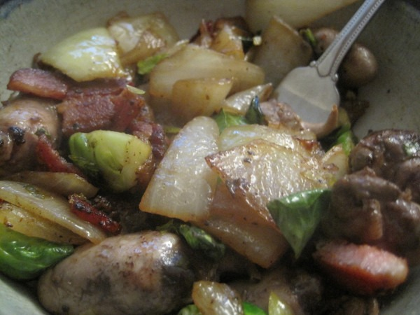

Version 1 = [Chicken Hearts + Bacon + Apples + Onions](/2010/12/chicken-hearts-bacon-apples-onions/). Version 2 = swap out the apples for Brussels sprouts. The dish was outstanding. For whatever reason, the chicken hearts tasted much better. It had none of the liver like gamy and bitter tastes that were slightly present before. The meat was sweeter and more tasty. The Brussels sprouts worked just as well as the apples. I plan to make this dish again soon. 

---

## Comments

### Ed
*December 28 at 2010 at 4:47 AM*

Did you sautee that in coconut oil?

---

### MAS
*December 28 at 2010 at 4:50 AM*

@Ed - No I used bacon fat for this recipe.  My 2nd choice would have been lard.  Brussels sprouts and bacon are a great match.  

I just made this dish again tonight.  I love it!

---

