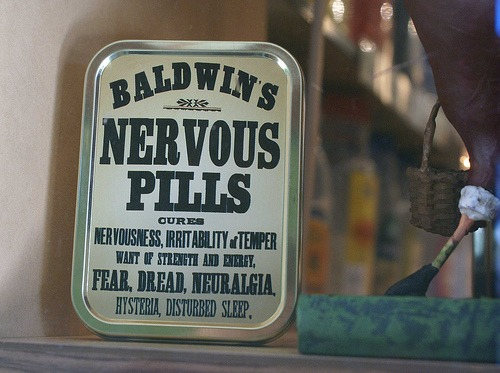

I am not a big believer in supplements. For the most part, I see the supplement industry as a bunch of charlatans selling the modern version of snake oil. **The supplement industry profits by exploiting your health fears and then pointing to themselves as the solution.** People are all too eager to pay for the fantasy that some supplement will stop them from getting sick or give them ripped abs. When it comes to your health, I believe that money is better spent on quality food, cooking equipment, and nutritional education.

Are all supplements bad? I don't know. My guess is there is more about nutrition that we don't know than what we do. There is a long history of supplements that were the rage that we now know are worthless. _Remember in the early 1990s how chromium picolinate was going to make us lean?_ Everything mankind has needed to survive has been found in food. I don't believe we are as smart as Mother Nature. I'm not alone in this belief. Michael Pollan wrote an entire book on this topic called [In Defense of Food](/2008/07/in-defense-of-food/).

_by Peter Konnecke_

What supplements do I take?

-   **Vitamin D3** - During the winter months, I take Vitamin D3, because I can not get it from sunlight, living north of the 37th parallel. Ironically, I am posting this today as [a new study](http://www.medscape.com/viewarticle/733318) has just come out saying that supplemental Vitamin D may not be necessary. I follow a few blogs written by trusted PhDs. I'll be interested to read their analysis.
-   **Fish Oil** - I am slowly phasing this supplement out. It is primarily used to correct Omega-6 to Omega-3 ratios. Since I source high-quality meat and have removed all seed oils from my diet, my n-6 to n-3 ratio is quite favorable. There is also an endless debate on which fish oils are good for you and which are terrible. I'd rather eat a can of sardines.
-   **Magnesium** - Many smart people on health blogs I read rave about the importance of supplementing with Magnesium.
-   **Creatine Monohydrate** - The only supplement that I know of that can produce drug-like effects. Creatine has been proven to add a few pounds of muscle. Is it real muscle, or does the muscle hold more water, making it look bigger? Who cares? I like the effect. :)

Supplements that may have value, but I don't trust them.

-   **Protein Powder** - I have gone back and forth on this one. High-quality protein should come from food, not a laboratory in New Jersey. However, I am an ectomorph who lifts weights. I may need it, but I'm highly skeptical. My nutritional mentors are split on this supplement. Perhaps I'll incorporate it into my [seasonal approach](/2010/10/fall-strategies-for-nutrition-and-fitness/) and take it during the summer, when my training level is at its highest?
-   **Multi-Vitamin** - Vitamins come from food. I believe the primary reason people are vitamin deficient is that they have poor nutrient absorption. Taking a vitamin doesn't solve that problem; it is just a hack. A better solution would be to stop eating grains and foods that spike insulin - both of which reduce nutrient absorption. Also, eat more high-quality animal fat. I recognize that some people won't take those steps, and vitamins may be useful.

One supplement that I will probably try.

-   **BCAA** - I've been reading about how branched-chain amino acids benefit the body during fasted resistance training, which I do. Art De Vany and Martin Berkham (LeanGains) are both proponents of BCAA supplementation.

I want to conclude by emphasizing that I am not certain whether supplements are effective. I suspect the majority don't. I'd rather focus my energy on eating a varied diet of clean, healthy food.

How about you? What supplements do you believe work?

---

## Comments

### thomas
*December 1 at 2010 at 3:13 AM*

Just bought Carlson's Fish Oil today thru Amazon.  I was told that it is is very important by a very smart person, so I guess we'll see how that goes.  

Not totally for vitamins either but the cost of a good multivitamin is so cheap (less than 20 cents per day) that it may be hard to argue against taking one.

What is magnesium good for and what is fasted resistance training?  

thanks

---

### MAS
*December 1 at 2010 at 3:22 AM*

@Thomas - Magnesium does a lot of things.  Two things it helps with is thyroid function and metabolizing Vitamin D.  

Fasted resistance training --> A few times a week (in the fall), I will do a 16 hour fast.  I time my trip to the gym to be close to the end of the fast.  Then I do high intensity weight lifting on an empty stomach.  There are a lot of beneficial hormonal states to doing it this way, including the ability to burn more fat.

---

### Stuart
*December 1 at 2010 at 3:44 AM*

Just getting back into the gym after ~9 months off. Was at Henry's today and they had a huge section dedicated to supplements.

I started looking for supplements I used to take back in College, the last time I was a serious gym rat. And the first one that came to mind...Chromium Picolinate!

I got a chuckle about your comment about CP in the 90's. Yep, I definitely remember that!

---

### MAS
*December 1 at 2010 at 3:46 AM*

@Stuart - 9 months - were you pregnant?  HA!!  :lol:

---

### Mike
*December 1 at 2010 at 4:29 AM*

My two bits on supplements:

1.  The human body is very efficient; it is really hard to become deficient in anything the body needs unless you are really malnourished. E.g.  Scurvy (lack of Vit.C) is really hard to get, took English sailors @ six months at sea without fruits or veggies. 
Anemia (lack of Vit B12 very rare unless maybe true blue vegetarian)
Rickets: (lack of Vitamin D) In the past usually due to poor parenting and feeding of kids (no fish, kept out of sun etc)

Nowadays alot of foods have critical supplements added: e.g. milk vitamin D: Salt, iodine; 

  Flip side: there is little proof that megavitamin therapy works.

2.  A lot of supplements are made in China (e.g.almost all the Vitamin C). There is no regulation of the industry even here.  Who knows what's in the stuff or if that multivitamin you are taking for "insurance" even has what its says on the label? Nobody tests.

3.  People have been living in northern latitudes with many months of lack of sunlight (vitamin D) for thousands of years.  They eat their deepwater fish or take their cod liver oil in winter. You see anything wrong with Brit Eklund? Thor Heyerdahl? Case closed. (ok, I'll concede on Bjork)

---

### MAS
*December 1 at 2010 at 5:55 AM*

@Mike - Excellent analysis.  

Even the sailors who got scurvy did it in the presence of simple carbs "water gruel sweetened with sugar" (GCBC p321).  Sounds like an 18th century version of Vitamin Water.  Carbs spike insulin and insulin blocks the vitamin-c receptor.(GCBC p325)

---

### Glenn
*December 3 at 2010 at 10:22 AM*

Thanks for the good post.
Magnesium - I'm starting to think the most absorbable way to get it is from bone broth and 100% cacao beans.

BCAA - I've been trying them off and on for the past couple of months, including before fasted weight training - haven't yet noticed an effect..

Loren Cordain promotes them as well. Maybe I should try a different brand...

Or maybe it's because I'm an old man (46). I'm starting to theorize that protein is much more efficiently metabolized by those under 30 or 35...

Evolutionarily it would make sense that those over 30-35 wouldn't need to gain more mass - they've already proven their reproductive fitness and don't need to carry non essential weight and/or consume highly costly animal protein...

Best regards,
Glenn

---

### MAS
*December 3 at 2010 at 4:21 PM*

@Glenn - Good to know.  I recently started making soups using bone broth.  I've also heard to avoid Magnesium Oxidate and get the Magnesium Citrate. 

In addition to physical age, there is also training age.  If you took someone else at 46 with no training experience they would still have potential to gain more additional mass.   

I've pretty much given up the quest to gain more mass.  My last gains came in my mid-30s.  Whenever I pushed it, I just got fattier or injured.  Often both.

---

### Matthew
*December 3 at 2010 at 10:25 PM*

I have found that BCAA taken post workout when fasted result in reduced muscle soreness particularly after intense workouts. 

However, if you're not going to be doing intense hour long work close together, I find you get all you need from a good pet food meatloaf.

---

### MAS
*December 3 at 2010 at 10:37 PM*

@Matthew - ROFL !!!

---

### RareArtists
*June 16 at 2012 at 10:25 PM*

@MAS, I'm wondering if you're still using BCAA and what you think about them....?  If you are still using them, what brand do you recommend?

My view on supplements is the same as yours, so I've been skeptical about BCAA... DeVany's rec made me wonder though  

I have an athletic background and have always been pretty fit, but I haven't done much focused strength training before ....but, currently as a 34 year old, I'm on my fourth month of Body by Science style HIT workouts, 12 minutes per week.  

I'm loving the workouts and still curious about BCAA....but I am very weary of consuming anything but food or at least a food based supplement

thanks

---

### MAS
*June 16 at 2012 at 11:43 PM*

@RareArtists - I have gone back and forth on BCAA. Right now I am skeptical of it. I still have half a container of it, but I most likely will not be replacing it. 

Check out this podcast interview with Brad Pilon.
http://fatburningman.com/brad-pilon-interview-intermittent-fasting-if-eat-stop-eat-and-how-much-protein/

To me Brad's opinion of BCAA makes the most sense.

---

