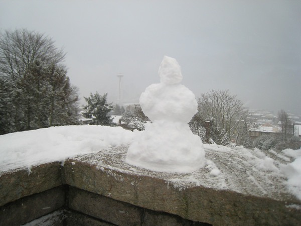

At the start of autumn, I posted [Fall Strategies For Nutrition and Fitness](/2010/10/fall-strategies-for-nutrition-and-fitness/), where I outlined my seasonal approach to a low-carb/paleo diet.

> The premise is that our bodies have growth and repair cycles, just like the planet. During the spring and summer is when the planet grows. Long days stimulate carbohydrate cravings and growth. The fall is when nature rests and repair begins for the following spring. Shorter days will reduce carbohydrate cravings _provided you don't bathe yourself in artificial light after sunset_ and stimulate repair.

> I believe many of today's health problems, especially cancer and obesity, are a result not allowing the body to go into a repair mode during the colder months. Repair means more sleep, less carbs and less exposure to blue light.

The focus of winter is fat loss, injury recovery, and rest.  _Kerry Park 2008 Snow Storm by MAS (can you see the Space Needle?)_ Here are my winter nutrition and fitness strategies.

1.  **Sleep More** - Continue loading up on sleep. Less daylight means energy conservation. This is the season for rest and repair. Longer sleep will boost your immune system, too. I have blackout blinds in my room and zero electronics. I'm now having the deepest and most restful sleep of my life.
2.  **Removal of All Sugars** - OK, not all sugars. The only acceptable sugar will be the small amount in the occasional piece of dark chocolate (73% or higher). Nothing else. That includes alcohol.
3.  **No Fruit Except Berries** - Fruit is not in season. Wait until spring.
4.  **Ketogenic Exploration** - Winter is the season for low-carbohydrate intake. When your carbohydrate levels drop low enough, you will enter a state called ketosis. During ketosis, the body burns ketones instead of glucose. Many dieters have found this is the holy grail of fat loss. I don't know if I ever entered ketosis. This season, I will purchase Ketostix to measure. Depending on how successful I am with regular ketosis, I may experiment with a cyclic ketogenic diet (CKD) closer to spring.
5.  **Cold Weather Exposure** - Cold weather means [cold weather training](https://criticalmas.org/best-of/cold-weather-training/). It'll toughen you up and you may lose some more fat.
6.  **Very Short Workouts** - Since my carb levels are low, I will keep exercise to a minimum. I want just enough to maintain current levels of strength and trigger hormone-sensitive lipase for fat loss. One brief high-intensity weight lifting session and one 4-minute Tabata per week should be enough. If I can do that without stimulating a carb craving, I may add an additional workout, but diet comes first. All workouts will be done in a fasted state. I will also add in some fasted [urban hiking](https://criticalmas.org/best-of/urban-hiking/) around Seattle.
7.  **Daily Intermittent Fasting** - I am going to use the Leangains 16 hour daily fast method. In the fall, I did about three each week. For winter, my goal is to do it daily. I'll also be supplementing with BCAA.

My primary goal for winter is fat loss. If I am to hit [Level 3 Leanness](/2010/12/moving-up-the-leanness-levels/) in 2011, it is most likely to happen at the end of winter. This is all uncharted territory for me. I've never done a ketogenic diet or daily IF. Will I make it? Stay tuned.

---

## Comments

### Mike
*December 22 at 2010 at 6:16 AM*

MAS, just sayin.... 
1.  We have discussed this before but your comments have a northern latitude bias which is not consistent with  paleo-reality.
 During the thousands of years of human paleo development it was more likely in temperate climates between 45 degrees north and south of the equator.

 Very few of our ancestors made the trek to northern Europe or Asia until way late in human development.  (Why the hell would you want to leave sunny Kenya or  Mesopotamia to go to Norway?)
 Neanderthal Man of Europe went extinct about 50,000 years ago though a small number mayhave survived to interbreed with the homo sapiens of the Middle East area which went on to be our forbears.
 There would have been plenty of fruit available most of the year for the majority of homosapiens located in the temperate zone; there would have been approximately 12 hours of daylight and 12 hours of nightime for those living close to the equator.  There would have been no need to develop cold tolerance.
The world population is located predominantly in this central latitude belt.  A very small percentage is located in the northern (or southern) latitudes.

2.  Cyclical Ketogenic Fasting.
a)  This sounds suspiciously like a theory to justify cheating.  I was on a true blue Atkins ketogenic diet for some years in the 70's and there is no doubt that it works.  However, it is soooo boring.  Every once in a while you just have to pig out on the simple carbs of your choice.  Then it takes about 3 days to get back into ketosis.  
b) There was talk back then (which needs to be looked into scientifically and which I suggest you think about before subscribing to CKD) that going in and out of ketosis screws up your metabolism so that when you are in the carb burning phase it takes fewer and fewer carbs to supply your energy i.e. you get fatter faster and lose fat slower on the next ketosis phase.

Mike

---

### Ahrand
*December 22 at 2010 at 10:37 AM*

interesting you mention leangains as your IF technique.
Note that he does NOT recommend fasted workouts !

See http://avidityfitness.net/2008/01/12/interview-martin-berkhan/

---

### rob
*December 22 at 2010 at 1:22 PM*

Those ketostix are handy.  Once you get the hang of it you can tell whether you in ketosis based on how your pee looks.

---

### MAS
*December 22 at 2010 at 4:05 PM*

@Ahrand - I am using the template on the Leangains site for morning workouts, which are done in a fasted state.

From <a href="http://www.leangains.com/2010/04/leangains-guide.html" rel="nofollow">The Leangains Guide</a>

<blockquote>6 AM: 5-15 minutes pre-workout: 10 g BCAA.
6-7 AM: Training.
8 AM: 10 g BCAA.
10 AM: 10 g BCAA
12-1 PM: The "real" post-workout meal (largest meal of the day). Start of the 8 hour feeding-window.</blockquote>

---

### MAS
*December 22 at 2010 at 4:13 PM*

@Mike - This is all one big experiment. Because the daylight hours are so extreme in Seattle, this is what I came up with.  We wouldn't recognize what our ancestors called fruit.  What we have today is "candy bars on trees".  Cold weather exposure, whether it can stimulate BAT or not, it does make one more resilient.  I'm not the baby I was when I left San Diego.  

CKD does sound like cheating to me as well.  I am skeptical, but I will look into it closer to spring.  The training protocols seem excessive, so I will approach this from a skeptical mind.  I tend to distrust the advice of most body-builders.

---

### MAS
*December 22 at 2010 at 4:23 PM*

@Ahrand - The interview you linked to was from Jan 2008.  His guide was put out in April 2010.  My guess is his opinion has evolved and as long as one uses BCAA fasted workouts are fine.  Perhaps optimal.  

I've been doing fasted workouts for 2 years now.  I have lost some strength (may be unrelated), but have got leaner.  Yesterday I added the BCAA for the first time.  I'll be seeing if this supplement helps.

---

### Glenn
*December 22 at 2010 at 8:46 PM*

What do you take with the BCAA? Just water? Or any flavorings, like juice? I find BCAA on their own without juice almost unbearably bitter and disgusting...

---

### Glenn
*December 22 at 2010 at 8:49 PM*

Also, to my thinking, working out hard and then staying in a fasted state is contrary to evolutionary logic. We are all the descendants of *succcessful* hunter-gatherers. Those who hunted hard but came up empty would have been more vulnerable to attack and sickness, right?

From the accounts of 19th and early 20th century hunter societies, the classic behavior was immediately after killing an animal to tear out its liver and eat it raw...

---

### MAS
*December 22 at 2010 at 11:44 PM*

@Glenn - Right now I am taking the capsules, but I am aware of flavored BCAA water mixes.  

I think you are right about ending a hard workout with food.  It doesn't make sense to stay in a fasted state.  Liver was prized.  I am reading a book now that details how one Indian tribe would kill the animal, eat the organ meat and feed their dogs the muscle.

---

