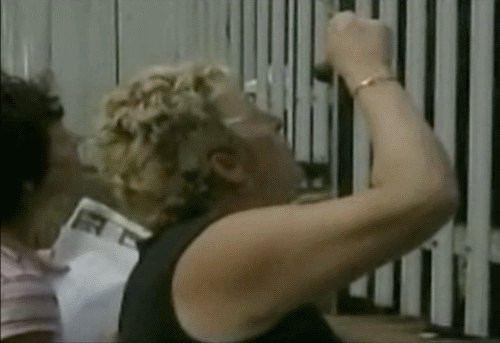

This book is considered a masterpiece in the study of human nutrition.  _Nutrition and Physical Degeneration by Weston A. Price_ was published in 1939 and might be more relevant today than it was back then. The story of this book is fascinating. A dentist from Cleveland traveled the world to study what different cultures ate and how it impacted their health. Dr. Price did this at a time just before the world got completely connected. He was able to see how traditional people lived. He was also able to see and measure the health consequences of people who had just been exposed to modern food. What he discovered is not a surprise to me or anyone who has been exposed to traditional food preparation. People were remarkably healthy and free of tooth decay before the arrival of white flour, sugar, canned food, and vegetable oils. Even more amazing than the story itself are the photographs in the book. The photos show the smiles of traditional cultures versus those that had been exposed to modern food. Even if you never get a chance to read this 500-page book, I highly recommend at least looking at the pictures. Parents especially. Readers of this site know that I am fascinated with how the body adapts to cold weather and my experiments with [cold weather exposure](https://criticalmas.org/best-of/cold-weather-training/). Dr. Price discovered that the Quichua Indians of Peru were far more extreme than me.

> Their capacity for enduring cold is wonderful. They can sleep comfortably through the freezing nights with their ponchos wrapped about their heads and with their legs and feet bare.

What about the practice of [fasting](https://criticalmas.org/best-of/intermittent-fasting/) to toughen one up? The Aborigines of Australia have a ritual that a boy must pass to become a man.

> ...he is tested for his ability to withstand hunger without complaint. The test for this is to go on a march for two or three days over the hot desert and assist in preparing the meals of roast kangaroo and other choice foods and not partake of any himself. He must not complain.

Compare that with the parents of today. Below is a photo of moms who showed up outside a California school to hand candy to their children at recess after California banned selling junk food in school vending machines.  _From the film [Killer At Large](/2009/06/killer-at-large-obesity-documentary-without-focus/)._ I loved this book. The lessons are as true today as they were back then. We are very fortunate that Dr. Price got a chance to meet and learn from these traditional cultures while they still existed. If you are interested in food and nutrition, this book is a must-read. I highly recommend it. And if you are interested in cooking more traditionally, get the book Nourishing Traditions.  _Nourishing Traditions: The Cookbook that Challenges Politically Correct Nutrition and the Diet Dictocrats by Sally Fallon._

---

## Comments

### Nick
*January 3 at 2011 at 7:58 PM*

Nice post.  My reading list just keeps getting longer and longer.

---

### Alex
*January 4 at 2011 at 12:57 AM*

I second that -- great post, MAS. How well could those of us who are not avid nutritionists follow the book?  And does this one meet the "if you could read only one book on nutrition, make it this one" criteria?

---

### MAS
*January 4 at 2011 at 3:31 AM*

@Alex - I wouldn't put this as a the top book for non-nutrition geeks.  It is 500 pages long and the early chapters are a little dry.  My pick for the best accessible book depends on the person.

---

