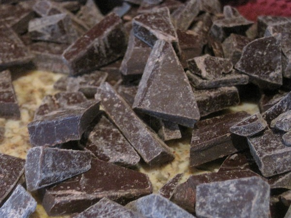

I love a good experiment and I'm about to start a new one. I've done 30 days without sugar and 30 days without fruit, but not at the same time. Yesterday I realized that if I really want to test the effects of removing fructose from my diet, then I need to remove both for 30 days. I may have drawn false conclusions from [my previous test](/2010/06/after-30-days-without-sugar/). Although I had intended to [cut my sugar and fruit intake over winter to near zero](/2010/12/winter-strategies-for-nutrition-and-fitness/), I haven't been successful. The [daily 16 hour fasts](/2010/02/intermittent-fasting-improving-your-success-rate-a-new-strategy/) have had both positive and negative effects. One of the negative effects is my sweet tooth, which was dormant for so long, seems stronger than before. Note that my idea of a "sweet tooth" is not the same as your average food court customer. It is much lower, but it is still double my normal low levels. This winter I've had more headaches than I've had since [giving up gluten](/2010/08/life-without-gluten/) over a year ago. The headaches come on while I am sleeping (around 3 AM to 4 AM) and are sinus in nature. I don't think it is a fructose issue, but I'm not 100% sure, which is why I am doing this 30-day test. Tomorrow is March 1st. It begins then.  _See you April Mr. Chocolate?_

---

## Comments

### Sheila
*February 28 at 2011 at 6:24 PM*

I can't wait to read as you start your sugarless, fructose-less endeavor!

---

### chuck
*February 28 at 2011 at 6:56 PM*

interesting.  not sure i could or would do this.  curious to read the results.  have you ever tried caffeine free for a period of time?

---

### MAS
*February 28 at 2011 at 7:05 PM*

@chuck - I did 30 Days of Low Coffee Intake.  After that post I continued on lower levels until winter.  Come spring I will cut my coffee intake down again.  Coffee is essential during the Seattle winter.

---

### Becka
*March 1 at 2011 at 12:18 AM*

I think I'm going to do a sugar-free March also. I try to eat pretty paleo...except I have a wicked sweet tooth that is tempted daily at work. I try for moderation with the free cookies and donuts that seem to appear at every meeting, but ultimately end up eating more of them then I would like. This would also eliminate the last of the gluten-containing foods I eat - bonus!

---

### MAS
*March 1 at 2011 at 12:47 AM*

@Becka - Good luck Becka.  I should have also mentioned that I won't be consuming artificial sweeteners either.  Giving those up was easy.

---

### Marian
*March 1 at 2011 at 3:10 PM*

I really think you should try 30 days without cheese.  I had a tiny amount of cheddar about a week ago and it screwed me up for days.  The timing of the headaches is also interesting - maybe it's something hormonal?

---

### MAS
*March 1 at 2011 at 3:46 PM*

@Marian - That would be the toughest test.  I love cheese so much that the headaches **may** be worth it.  :)

---

