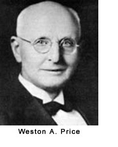

In December, the site _Latest in Paleo_ (then called _This Week in Paleo_) awarded this blog the "Paleo Blog of the Week" _(episode 14)_. It was quite an honor to see this site on the same list as so many of my nutritional mentors. My journey toward the paleo diet started in 2008 and has undoubtedly improved my health. However, in mid-2009 I started down a parallel path in my understanding and application of nutrition. It was then that I learned about Dr. Weston A Price and his [research into diets used by traditional cultures](/2011/01/nutrition-and-physical-degeneration/).  Paleo diets are excellent at removing the neolithic poisons of processed foods, vegetable oils, and sugar. By resetting your diet to just before the agricultural age, you should see a marked improvement in health. However, I think we can learn a lot from traditional cultures that aren't addressed with a strict paleo diet. Throwing out the knowledge gained between the end of the Paleolithic era and modernization is probably not a wise thing to do. Here are the areas of nutrition I feel the Weston A. Price (WAPF) (aka The Nourishing Traditions) group does a better job promoting than the paleo diet.

### Organ Meats

Organ meats such as liver and hearts are nutritional powerhouses. The paleo diet permits them, whereas WAPF makes them a cornerstone of importance. Traditional cultures didn't have the labs that told them how nutrient-rich organ meats are, but they figured it out. I'm eating organ meats every week now.

### Fermented Foods

Traditional cultures used fermentation to make food more digestible. Today we eat mostly dead food from cardboard boxes or wrapped in plastic. It wasn't always that way. Fermented food has probiotics that build our immune system and help nutrient absorption. The paleo diet is mostly silent on this topic.

### Full-Fat Dairy

The paleo diet is mostly anti-dairy. I think the story of dairy is complicated. Some people have allergies and some people thrive on dairy. My roots are Northern European. I'm pretty sure my body does an excellent job with dairy. If I were a Native American or Pacific Islander, I'd probably side with the paleo crowd on this topic. There is also a considerable difference between full-fat dairy from a pastured farm and the reduced-fat ultra-pasteurized grain-fed milk-like swill sold in the grocery store.

### Bone Broths/Stocks

The WAPF group is a huge proponent of making healthy bone broths_._ From their article [Broth is Beautiful](http://www.westonaprice.org/food-features/broth-is-beautiful):

> Stock contains minerals in a form the body can absorb easilynot just calcium but also magnesium, phosphorus, silicon, sulphur and trace minerals. It contains the broken down material from cartilage and tendons--stuff like chondroitin sulphates and glucosamine, now sold as expensive supplements for arthritis and joint pain.

Not only do these broths taste much better than the pre-packaged ones, but you just [feel better](/2011/01/how-i-fought-off-a-potential-cold/) after having a stew with real broth. One area in which I side with the paleo crowd over the WAPF group is grains. Traditional cultures used soaking and sprouting techniques to disable the anti-nutrient properties of grains. Although wiser than modern society, which gleefully scarves down non-sprouted bread with each meal, I suspect that avoiding grains is still the best option.  _Nourishing Traditions: The Cookbook that Challenges Politically Correct Nutrition and the Diet Dictocrats by Sally Fallon_ I still think the paleo diet is an excellent foundation. However, I think we can learn a lot about food from traditional cultures. I'm not alone in the blogging community. Many other paleo and low-carb bloggers are discovering and embracing the nutritional philosophies of Weston A. Price. I see the paleo diet as primarily about food choices, whereas the Weston A Price group focuses on food preparation. I think they complement each other nicely.

---

## Comments

### chuck
*February 24 at 2011 at 9:46 PM*

i follow a few WAPF blogs and am constantly AMAZED what they do to grains before they eat them.  even then they discuss how there could be some antinutrients left behind.  they continually talk about nourishing themselves but won't give up nutritionally void grains.  i have seen some of the WAPF bloggers start to move away from grains because of what they have read from the paleo side.  they do have some good principles.  i can say i save every bone now and am looking forward to making some broth.  have made chicken broth but not beef yet.

---

### MAS
*February 24 at 2011 at 9:55 PM*

@Chuck - There are supposedly heirloom grains that **may** be much more healthy than what we are currently exposed to.  I remain skeptical, but I'll keep an open mind.  People have a drug like addiction to bread and will do just about anything to justify eating it.

---

### Tricia
*February 28 at 2011 at 10:01 PM*

I’m not alone in the blogging community.  Many other paleo and low-carb bloggers are discovering and embracing the nutritional philosophies of Weston A. Price.

Hey Michael~ thanks for your great thoughts on Paleo and WAPF... I am also intrigued by their complementary aspects.  Who are some of the other bloggers you are referring to that are interested in this?  Thanks!

---

### MAS
*February 28 at 2011 at 10:18 PM*

@Tricia - Jimmy Moore's Livin La Vide Low Carb podcast has increasingly brought up WAPF guests and topics.  Chris Masterjohn and Stephan Guyenet are two WAPF bloggers I read.  Also check out The Healthy Home Economist.

---

### D.
*March 11 at 2011 at 8:04 PM*

The WAPF folks do NOT recommend eating a lot of grain.  Very little, in fact.  Usually it's a wintertime food, like oatmeal, because it's a comfort food and it's rib-sticking for those of us who work hard outdoors all day.  If you're going to talk about WAPF, you first need to totally submerse yourself in the reading, learn all there is, and THEN talk about it intelligently.  

Another good blog concerning WAPF is The Nourished Kitchen.  Excellent videos and recipes and other stuff there, too.

---

### MAS
*March 11 at 2011 at 8:17 PM*

@D. Smith - I am in the Ballard chapter of WAPF.  I've read both Weston Price and Sally Fallon.  I've also read numerous articles on the WAPF site and listened to podcasts.  In the past year, I've attended two WAPF presentations that were focused on grains (heritage and grinding).  I HAVE immersed (not submersed) myself in this topic.  

The WAPF people love their grains.  They are no different that the average person, with the exception of how they prepare them.  At this time I disagree with them on grains.

---

### D.
*March 11 at 2011 at 8:36 PM*

I'm, sorry.  I wasn't even talking to you, I meant to address Chuck.  You are free to feel about grains however you wish, of course, but I don't intend to live without them. I like sourdough products and there's absolutely nothing wrong with that.

BTW, immerse and submerse are relatively the same, and are interchangeable in this regard. I have a degree in English.

---

### MAS
*March 11 at 2011 at 8:38 PM*

@D. Smith - Thanks for the grammar tip.

---

### chuck
*March 11 at 2011 at 8:52 PM*

DSmith:
I admit I haven't read Weston Price or Sally Fallon outside of the WAPF blog.  I have read a lot of real food, nourishing food, WPAF follower blogs throughout the years.  They do seem to eat a lot of grains in the forms of breads and desserts.  I have recently seen experimentation within that circle of going grain free with these people actually feeling better.  I guess my point was to just partially remove the inherent toxins from grains is a lot of work.  We have many food options unlike the cultures WAPF studied.  There are plenty of more nourishing food options than grains.

---

### Cathy
*April 5 at 2011 at 2:19 PM*

I was happy to read this.  

I've been on a low-carb diet before and felt wonderful, lost weight, slept better, had more energy, etc.  A fourth pregnancy and a child with grain allergies sent me shooting off in a completely different direction.  One filled with millet, spelt, sorghum, teff, quinoa, etc.  A boat-load of grains, in short.  

I bought Nourishing Traditions a year or so ago and simply set it aside, for the most part.  Although I loved the information it contained, it seemed too daunting with four small children.  And, yes, the thought of spending a night soaking grains before using them just seem like too much.  

After recently reading some info on Robb Wolf's site about the paleo diet, I again began to consider the physiological ramifications of our now high-grain diet.  I'm not able to lose belly fat, I'm not sleeping well, allergies are high in our home, etc.  

I'm also not completely on board with the no-dairy recommendation.  But mostly because it's quite difficult for me to prepare quick and easy meals for children with no grains AND no dairy.  Perhaps after they're older I'll try cutting out all non-fermented dairy.  (We are fortunate to live near a raw milk farm and to be able to milk our own goats so that helps.) 

I agree about the phytate (?) issue in NT.  They are diminished but not eliminated so why encourage eating them if they are toxic to our bodies?  I'm looking into more research on the cellular level about what grains are doing in our bodies.  If you've got any suggestions, please let me know.  

P.S. I also have a degree in English but wasn't aware of the term "submerse" being used in that context, either.  :o)

---

### MAS
*April 5 at 2011 at 3:50 PM*

@Cathy - Removing sugar, grains and veggie oils is often enough for us to meet our health goals.  I have yet to even consider removing dairy.  I've achieved 99% of my health goals and I eat dairy daily.  

Good luck!

---

### Moo
*August 14 at 2013 at 1:31 AM*

Whenever one hears "Im not about to give up....blah blah blah", the implication is addiction, no?

---

### Jonathan
*August 14 at 2013 at 11:51 AM*

@Cathy W You should check out Devils in the Milk or at least the review.  Very interesting information about Milk.

Goats milk is all A2 casein which is one of the major problems some people have with milk.  The other major problems being related to pasteurization and homogenization.

http://goo.gl/Teqy9

Here's the wordpress article with the review on it.  It goes over some of the more important parts.

---

