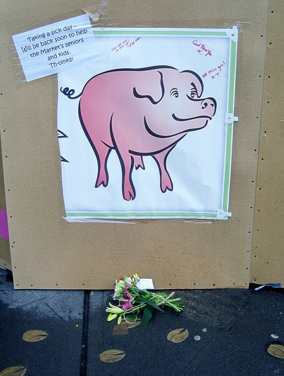

Yesterday morning a taxi ran into Rachel the bronze pig at Pike Market. From MSNBC's _Taxi crashes into Pike Place Market pig statue_ (link now gone):

> A taxi driver hit the gas when he was rear-ended nearby early Saturday and plowed into Rachel the Pig, a 550-pound, bronze piggy bank that has stood outside the market's famous fish-throwing stand since 1986.
> 
> The crash knocked the pig off her concrete base, which will have to be repaired. Market officials say it will probably take a few days. The statue itself was also scratched up a bit.

Today I stopped by and saw this "get well soon" roadside. Someone even set down flowers. I love this city.

Here is photo of me with Rachel the Pig from 2008.

_Happier Times ...for the pig ;)_

---

## Comments

### Sheila
*February 7 at 2011 at 3:13 AM*

why "happier times"? 

I have never been there...yet,

did you pick up any good paleo food on your visit there today?

btw, as I have been catching up on your blog, I find so much I agree with you on, such as "burnt bean coffee", people think I am crazy when I tell them that is why I dont like the flavor of Starbucks.

---

### MAS
*February 7 at 2011 at 3:23 AM*

@Sheila - Happier times for the pig, not me.  :)  I'll update the post to be more clear.  

I packed a paleo meatloaf with me.  Grass fed beef + sliced beef liver.  

Starbucks roasts too fast to allow the coffee to realize it's true potential.  I toured their pilot roaster last year.  They are roasting between 9 and 12 minutes at that level of darkness.  That is fast.  My home roasted coffee is much lighter and takes 14 minutes.

---

