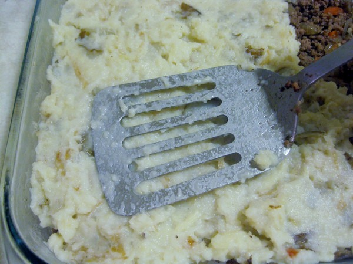
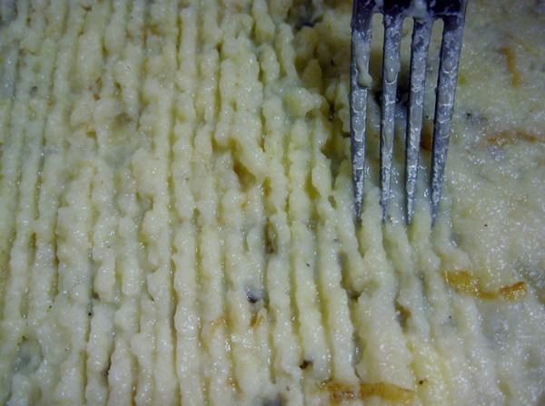

A traditional _Shepard's Pie_ recipe uses ground lamb topped with mashed potatoes and is then baked. What I did this week was use grass-fed ground beef and instead of topping it with mashed potatoes, I covered it with a mixture of mashed parsnips, sunchokes, and celery root. Tasted great. I used the [Easy Shepard's Pie recipe](http://simplyrecipes.com/recipes/easy_shepherds_pie/) as a template to get started.   