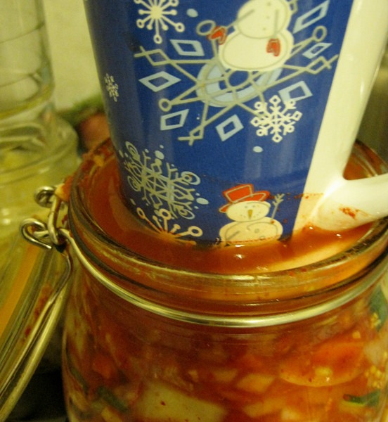

Several people have asked that I post an updated kimchi recipe. I've learned a lot since my original [Bok Choy kimchi recipe](/2010/04/bok-choy-kimchi-recipe/) was posted. One of the things I learned is there are infinite ways to make kimchi. In this post, I want go over the basics for creating your own custom kimchi recipe. It is not meant to be complete, but instead serve as a foundation for beginners.

### Ingredients

The most common ingredients I've used include:

-   Nappa cabbage, bok choy or some combination
-   Onions - regular and/or green onions
-   Garlic
-   Ginger
-   Daikon (often referred to as a radish in Korean cookbooks)
-   Carrots (not in traditional kimchi, but they add a nice sweetness)
-   Sea Salt (I use Redmond Sea Salt)
-   Korean red pepper flakes (gochugaru)
-   Sliced Asian pear (for sweetness - optional)

### Chop Up the Cabbage

The cabbage should be cut into whatever sized pieces you want to eat. Traditional kimchi will often have very large pieces. The smaller you chop, the easier it will be to pack the jar later. There is no wrong answer.

### Starting the Fermentation

To make sure the good bacteria win the battle against the bad bacteria, you'll be mixing the sea salt into the cabbage. There are 2 techniques that I am aware of that accomplish this.

1.  **Make a Brine** - This is the technique I used in the [Bok Choy Kimchi Recipe](/2010/04/bok-choy-kimchi-recipe/). It involved mixing a lot of sea salt into clean water and then letting the cabbage soak for a few hours. The cabbage takes in the salt. The brine is drained. I've made many excellent kimchis with this method, but it does require the most salt and the kimchi may not be as crispy as you prefer.
2.  **Rub in By Hand** - These days I add the salt to the chopped cabbage and then rub it in by hand. Then I leave it alone for an hour. The cabbage softens during the this time. It is ready for the next step.

How much salt should you use? If you look at other recipes, you will see wildly different salt recommendations. Who is right? They all are. I've done lower salt and higher salt and they both taste good. Currently I am using a little more than 1/2 tablespoon per pound of cabbage.

If you have salt concerns, I have read recipes that suggest gently rinsing the cabbage after you've rubbed in the salt and allowed it to sit for a few hours. They say that the salt has done its job and can be rinsed. I have not tried this, so I can not comment. The salt has never bothered me. The [Fermentation Workshop DVD](/2011/10/the-fermentation-workshop-dvd-is-outstanding/) mentions that you can use seaweed in place of salt.

### Add The Other Ingredients

Some recipes say you should put the other veggies in with the cabbage when you add the salt. I don't do that. I use the time the cabbage is softening as my time to prepare the other ingredients. Chop everything however you like, however I do have a few tips.

1.  Don't grate the ginger. Chop it into tiny pieces. Grated ginger loses its flavor and tastes mushy in kimchi.
2.  Daikon works best when cut into little cubes. Like baby dice.
3.  If you don't have Korean red pepper flakes, you can use Italian Red pepper flakes. I found it is hotter, so use less. It is also less flavorful.

### Mix and Pack in Jars

Mix all the ingredients and pack tightly into jars. Make sure there is about an inch of room at the top. You also want to make sure all the veggies are underneath the water. Fermentation is anaerobic. If the veggies peek their head out then the bad bacteria could be invited back. This is a minor concern with kimchi, but important with longer ferments like sauerkraut.

_Push those veggies down. They need to be below the liquid._

For more ideas on managing multiple or larger ferments read the post [My Fermentation Station](/2011/10/my-fermentation-station/).

### Pushing Down the Kimchi

Most recipes use some sort of weight (crock) that sits on the top. This keeps the veggies under the liquid for fermenting. Another option is to do what I do. Twice a day I push the veggies down. Doing this triggers a release of bubbles to the surface. I'm not against using the crock method, it is just that I don't have one that works well with my jar.

_Here I am using a coffee mug to push down the veggies._

### Leaving the Kimchi to Ferment

You will want to put a plate or bowl underneath your kimchi jar, as the juices can over flow. You'll also want to cover the jars with an old towel or upside down paper bag to prevent light from hitting it. The best temperatures I've found for ferments are in the mid 60s to low 70s. Once it get warmer than that the fermentation speeds up, so you'll want to add more salt to slow things down. Cold temperature ferments are the more the traditional ones that take much longer.

This leads us to the question on how long to ferment? Recipes online range from 2 days to months. I have found 6 days is my usual ferment period. Some things to consider:

1.  The longer the ferment, the more the cabbage will move from crisp to soggy. Not a bad thing. Just personal preference.
2.  The warmer the area you are fermenting in, the shorter the ferment takes. This is a summer concern if you have a warm kitchen. Move your setup to a basement if you can during the heat of summer.
3.  Doing a "jump start" can reduce your ferment by a day. If you mix in a little kimchi from your last batch into the new one, the ferment goes a little faster.
4.  Adding sugar or fruit, such as an Asian pear, will speed up the fermentation. It may be ready in as little as 2-3 days. If you are in a hurry, use this method.

### Done

I highly recommend tasting as you go. By eating a small amount at different points during the ferment, you will learn the taste profile that you like best. Once the fermentation is to your liking, just seal up your jar, wipe it down and put it into the refrigerator. This slows down the ferment. Good luck!

---

## Comments

### chuck
*March 15 at 2011 at 8:36 PM*

MMMM.  My original batch I modified from your Bok Choy Kimchi recipe is nearly gone. Almost time to make more.  I used napa cabbage because of price but will probably try something like bok choy for added color.  Thank you for a more detailed tutorial.  Although it really is easy or I just got lucky the first time.

---

### MAS
*March 15 at 2011 at 8:38 PM*

@Chuck - It really is easy.  Currently I'm enjoying a 2 Nappa to 1 Bok Choy ratio.  Nappa seems to hold the salt better and Bok Choy retains the most crunch.

---

### Sheila
*March 15 at 2011 at 11:23 PM*

Very interesting.  The salt content is a reason I avoid kimchi, but it looks so good.

---

### MAS
*March 15 at 2011 at 11:36 PM*

@Shelia - Try the rinse method.  I suspect it will work.  

For the past year I have been eating about 1# of kimchi a week.  Last weekend I had my blood pressure tested.  Perfect numbers.  But I also consume zero processed carbs and drinks, which tend to have high salt amounts.  I also rarely eat out.  I think that gives me a little head room when it comes to salt intake.

---

### thomas
*March 16 at 2011 at 8:11 AM*

Does eating fermented foods give you a lot of gas?

---

### MAS
*March 16 at 2011 at 2:35 PM*

@thomas - Not for me.  Actually I think the fermentation does a form of breakdown that reduces it.

---

### Eric
*April 20 at 2011 at 5:13 PM*

How long does opened kimchi last in the fridge? Ive been thinking about eating my own and getting hungry about the one that his been sitting opened in my fridge for over a month now.

---

### MAS
*April 20 at 2011 at 5:18 PM*

@Eric - I seal mine once it goes into the fridge.  At that point it should last at least 6 months, maybe longer.  

I do not know how the kimchi keeps if it is not sealed.  I'd probably eat a small bite and then if I felt OK, seal it up and have more the next day.  

A better option might be to remove the veggies at the top (to be safe) and start eating the kimchi that wasn't exposed to the open air.

---

### John
*July 21 at 2011 at 3:42 PM*

Do you know if you can use wine yeast in Kim Chi?  I have started to make a batch and it doesn't seem to be fermenting right and I was wondering if it would spoil the batch if I put wine yeast in my Kim Chi???

---

### MAS
*July 21 at 2011 at 3:57 PM*

@John - I have not heard of using wine yeast. If your ferment isn't taking, you may need to increase the salt. What do you mean by not fermenting right?

---

### John
*July 21 at 2011 at 4:38 PM*

After 8 days, it isn't bubbling the way it has previously.  Nothing foul about it.  Certainly warm enough.  Salt can help???  I did not know that.  Do you know if wine yeast is different from fermentation yeast?  Does fermentation yeast produce alcohol first and then vinegar?  It has always been my understanding that the yeast source is the cabbage itself as with grapes and apples, but I do know know if wine or grape yeast is a different organism than cabbage/fermentation yeast.  I know there is beer yeast and bread yeast etc, so I was just thinking about kick starting my Kim Chi if necessary.  Many thanks.

---

### MAS
*July 21 at 2011 at 4:43 PM*

@John - Most of the bubbling will take place in the first few days. Then it slows and stops. That is normal. Your kimchi is probably done. Mine is usually finished on Day 6, sometimes if the weather is warm, Day 5.  

Have your tried tasting it? My guess is that it might be on the soggy side by now. I have never tried to jump start a ferment in progress, my salt comment was about your next ferment.

---

### John
*July 21 at 2011 at 5:51 PM*

Thank you very much again.  I always add salt of course, is it a necessity for fermentation?  Or is it just for our taste buds?  Also, do you happen to know about my previous question regarding types of yeast?  Thanks again, perhaps you are right it may be done.  I will check it tonight.  Cheers and happy fermenting!

---

### MAS
*July 21 at 2011 at 5:55 PM*

@John - In order to jump start fermentation, you need either salt or whey. Otherwise, the bad bacteria take over and the food rots. I have not done any ferments using whey. It is much easier to acquire and store a good sea salt.

I do not know about alcohol yeasts and fermentation, so I can't draw any comparisons.

---

### MAS
*July 21 at 2011 at 11:22 PM*

@John - I did some more research. If the area you are keeping the kimchi is above 76 degrees, you may have trouble getting the ferment to start. With the current heat wave, this might be a problem depending upon where you reside.

---

### John
*July 22 at 2011 at 3:15 PM*

Thanks very much you’ve been extremely helpful.  Great to meet you over your blog .  I’m not too terribly far from you, I am in Cranbrook, BC.  I’ll actually be in Seattle in August.  I think you are correct, the Kim Chi tastes great and I think it was done fermenting before I realized it.

Thanks again.

---

### Wayne
*July 23 at 2011 at 6:15 PM*

Do u need to put an airtight lid on once u pack the jar or does it need the air to ferment?

---

### MAS
*July 23 at 2011 at 7:54 PM*

@Wayne - Not using the method I describe. In fact, an airtight seal could result in a kitchen accident when you go to open it. I once accidentally sealed the kimchi in the first 24 hours. When I checked out it, I got a blast of fermented veggies. I leave a crack, this prevents a build up of pressure.

---

### Wayne
*July 24 at 2011 at 11:10 AM*

Haha ok thanx,cant wait to try making this

---

### Rhonda
*August 8 at 2011 at 7:01 PM*

I made a batch of kimchi . Let it sit for 9 days. I put a thick cloth and a plate on top of the jar. I didn't check till this morning. I had mold growing on top. Was very careful when scooping the mold off. I washed my spoon each time and took about 2" off. It tasted fine. Do you think it is still ok to eat ?

---

### MAS
*August 8 at 2011 at 7:04 PM*

@Rhonda - I would do that same thing. I'd scrap off the top and throw that away. Then I'd try eating a very small amount. If you feel OK, have a little more the next day.  

The next batch of kimchi you make, check on it and make sure that veggies are below the liquid line. I push mine down 2x a day and I never get a mold problem.

---

### J.
*October 2 at 2011 at 12:18 AM*

@MAS, First batch of kimchi is in the basement. I made two quarts mild and and a couple more spicy. I reserved some of the brine to top off the jars, and my stuff looks exactly like yours pictured. We have a dark storage room in our basement that now smells like a Korean restaurant:))

---

### Laura
*June 23 at 2012 at 3:53 AM*

Hi Michael! I am going to try out this recipe this weekend, it looks great! I just picked up the Korean red pepper from the market today, but I have never used it before. How much would you recommend putting in the kimchi? Thanks!

---

### MAS
*June 23 at 2012 at 4:12 AM*

@Laura T - That depends upon how spicy you like it and how much salt you will be using. A good first pass might be to use 2/3 tablespoon of sea salt per pound and 1/3 tablespoon of red pepper flakes per pound of cabbage. You can always adjust later. If you are heat sensitive, use less. You should also taste the mix raw before jarring to get a sense you have a ratio that works for you.

---

### Lauran
*February 2 at 2013 at 7:22 PM*

FYI- if you want a nice kimchi paste, use Mochiko rice flour (3/4 water to 1/4 cup rice flour, mix and cook at medium temp for a few minutes, once it starts to boil, you can add whatever sugar is in your recipe, take off and then put it in the blender with your ginger, red pepper, garlic, etc., and it makes a beautiful paste that gives that authentic kimchi consistency/color.  It really upped my kimchi game! ;)

---

### MAS
*February 3 at 2013 at 4:26 PM*

@Lauran - I am familiar with that method, but haven't tried it yet. I understand that once you make the paste, the ferment times are much shorter. Like 1-3 days. How long did you let your ferment go with the paste?

---

### Laura
*February 6 at 2013 at 4:32 AM*

love this recipe! i've used it many, many times. however, i find that i have trouble getting the veggies to get below the water line. in that case, would it be ok to add some water to the jars to ensure that everything stays underwater? thanks!

---

### MAS
*February 6 at 2013 at 4:36 AM*

@Laura T. - Absolutely. For each cup of water you add, mix in 0.5 - 1 teaspoon of sea salt.

---

### madiha
*January 29 at 2015 at 10:52 AM*

I accidentally put lot of ginger in kimchi now its taste like ginger all over and now i dont know how reduce that flavor can help me or suggest me any thing to reduce it plz

---

### MAS
*January 29 at 2015 at 2:39 PM*

@madiha - Whenever you make kimchi that is too strong , be it spices or ginger, you can always use it in soups or with fried rice.

---

### madiha
*January 29 at 2015 at 2:46 PM*

ok but it taste like tooo strong acctually i naver had kimchi before because it is not available in my country so i made it for the first time may be thats why i am not liking the taste of ginger well thanks for the reply

---

### MAS
*January 29 at 2015 at 2:53 PM*

@madiha - I am telling you ways to eat the kimchi that will reduce the strength. If that doesn't work for you, give it away and start over.

---

### madiha
*January 29 at 2015 at 3:03 PM*

Hm i get it thanks for the help

---

