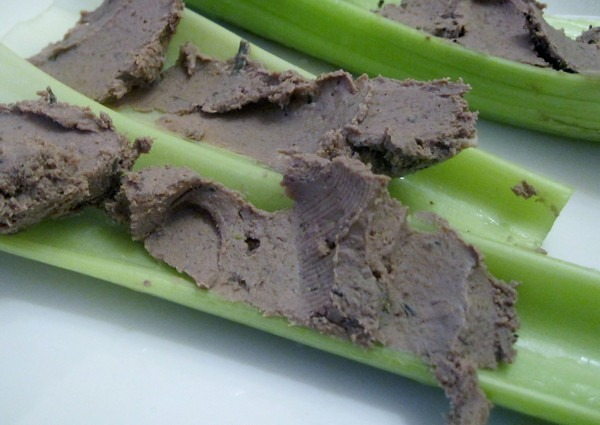

For all my friends that still can't bring themselves to eat healthy pastured beef liver, I have the solution. How about making your own creamy pate? I did it earlier this week. It was very easy. I found a [beef liver pate recipe](http://farmlet.co.nz/?p=199) from a small New Zealand farm that worked great.

Once the pate has chilled, you can spread it on celery or sliced cucumbers. I've read several sites that recommend eating 1/4 pound of beef liver each week. Using this recipe, you'll have all your liver needs met for an entire month.

Store bought pate can be expensive. This recipe wasn't. A pound a healthy beef liver in Seattle goes for about $4 a pound. The rest of the ingredients are dirt cheap. You'll be hard pressed to find a more nutrient dense food at such a low price. Swap out regular butter for Kerry Gold to make it even better.

_Homemade Beef Liver Pate_

---

## Comments

### chuck
*March 5 at 2011 at 4:28 PM*

So my grandma loves beef liver, it seems anyone who is 87 also loves beef liver.  It's a lost delicacy.  I had also read how we should regularly eat beef liver because of how nutrient dense it is.  So I told my grandma I had a full, all natural, grass fed beef liver in my freezer that I wanted her to cook classic liver and onions for us.  No one else was interested in eating it.  So she cooked it and loved it.  I had never had beef liver.  I did not like it, as much as I wanted to.  Maybe I need to try it a different way.  Next experiment with grandma is chicken liver, another thing all 87 year olds seem to like.

---

### MAS
*March 5 at 2011 at 6:00 PM*

@Chuck - Another cooking option for liver is to first saute garlic.  Cooking in small pieces also helps.  I also like adding mushrooms.  Chicken liver tastes better, but I don't think it is near the nutrient quality of beef liver.  I could be wrong, but I actually feel different hours after eating beef liver.  I find it is the perfect food to eat the day before you go to the gym.

---

### Ed
*March 7 at 2011 at 2:36 AM*

Mike, do you eat meat every day?

---

### MAS
*March 7 at 2011 at 2:50 AM*

@Ed - Yes.  I making up for the <a href="https://criticalmas.org/2008/07/im-not-a-vegetarian/" rel="nofollow">lost years</a>.  :)  I am only eating pastured meat though.  I still avoid the factory farmed stuff.

---

### D.
*March 11 at 2011 at 8:06 PM*

Chicken liver makes good pate, and so does goose liver.  Reminiscent of Julia Childs, huh?!

---

### Allison
*March 12 at 2011 at 6:15 PM*

Thanks for the recipe idea.  I am now inspired to try it.

---

### Dhammy
*December 25 at 2011 at 4:01 PM*

Mas, made this great pate yesterday for Xmas dinner today.  It'll be interesting to see if anyone eats it.  But if not then more for me!

---

### Sean
*February 16 at 2012 at 12:10 PM*

This recipe also works well for lamb liver. Lamb liver is easier to find here in the UK, and lamb are generally raised better than beef. £2-4/kg ($1.42-2.85/lb) for good Welsh or New Zealand lamb liver in every shop.

---

### Kristen
*February 29 at 2012 at 8:19 PM*

MAS, 
My husband, J. Scott has been trying to lure me into eating liver and so to appease him, I made calves liver pate this past weekend. I LOVE IT.
Ideally, I'd be eating the pate on crackers or a baguette but I gave up grains so am eating as you recommended on cucumbers and celery. I've been sharing the recipe with friends and it is getting rave reviews. Thanks so much for sharing it with us. 
Also, I bought more liver to mix in with meatloaf and we'll see how that goes. 
We really enjoy your site. 
Kristen

---

### MAS
*February 29 at 2012 at 8:29 PM*

@Kristen - Glad you liked it and thanks for the kind words!

---

### Diplome
*April 4 at 2012 at 12:03 AM*

I found your recipe whilst searching for a beef liver pate' recipe. Newly arrived back from the U.K. and I miss the wonderful locally sourced pates to be found at our small village market.

Today was the first day of using my new grinder (purchased to avoid additives and pink slime) and I usually grind my liver before blending. This recipe looks perfect. By the way, I spent my very young years in Enumclaw, showing horses at the King County and Puyallup Fairs...and Seattle remains one of my favorite cities to visit. It truly is the Emerald City.

---

### MAS
*April 4 at 2012 at 3:00 PM*

@Diplome - Thanks for stopping by. Here is another recipe that I plan to try the next time I make pate.

http://freetheanimal.com/2011/12/beef-and-chicken-liver-pate.html

---

### Diplome
*April 28 at 2012 at 4:57 PM*

Thought I should visit again and let you know the Pate was simply brilliant. I loved it, my husband loved it, our guests loved it. The recipe is now safely placed in my personal kitchen bible. Thank you so much.

---

### MAS
*April 30 at 2012 at 3:05 PM*

@Diplome - Glad you liked it. I need to make some more myself!

---

### Kas
*October 7 at 2012 at 4:50 PM*

THANK YOU!  I am trying this with my moose liver.  Also got a great recipe from a friend for 'liver mush' aka 'poor boy pate' from a southern buddy.  
Kas in AK

---

### Domian
*October 20 at 2012 at 12:38 AM*

Delightful!  Everyone who has tried it says its fabulous .    I tried with Deel  liver    noi bad.

---

### kyle
*November 28 at 2012 at 7:38 AM*

Um I do not know the recipe on hand but there is a way to make like a butter spreadfrom liver by blending it and add seasonings you could probably look into it my dads coworker makes it from deer liver whenever he gets one and it is absolutely delicious and extremely healthy the liver stores vitamins and it's already broken down so it would be easily digestable.

---

### Nelda
*April 22 at 2013 at 12:15 AM*

Hi Michael, I typed "beef liver pate recipe," and lo and behold, your blog page was the first that came up! I tried the New Zealand recipe, adapting for items I was missing (was out of onions; had only 1 lb of liver; subbed rice wine vinegar for red wine, apple cider vinegar for lemon juice, ground mustard seeds for dijon mustard, dried thyme and rosemary for fresh). All in all, P. and I really liked this recipe (or my adaptation of it from being too lazy to go to the store today). My adaptation was a little peppery for me, but P. really dug it. We liked this better than the liver pate recipe I found at the Weston A. Price Foundation site, which was supposed to be a chicken liver recipe, but I used beef liver; that one came out a little dry. I've gotten into the Weston Price thing lately due to health considerations, with good results so far. Anyway, thanks from P. and me! Cheers, your old pal, Nelda

---

### MAS
*April 23 at 2013 at 3:36 AM*

@Nelda - Great to hear from you and glad to hear you enjoyed the recipe. Sorry your comment didn't show up right away. I think you had javascript turned off, so my filters think it is a SpamBot.

---

### Denver
*December 18 at 2013 at 7:11 PM*

Too many poisons in organ meat to make it part of a regular diet.

---

### MAS
*December 18 at 2013 at 8:34 PM*

@Denver - Not true. 
http://www.marksdailyapple.com/does-the-liver-store-toxins/

---

